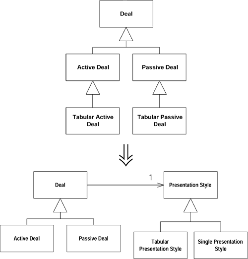
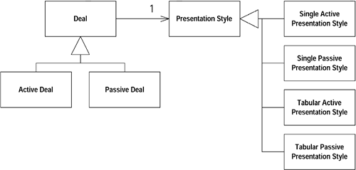
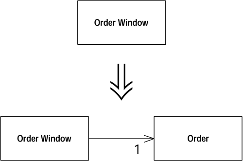
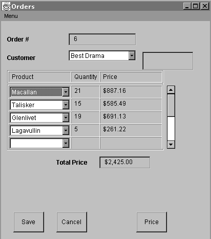
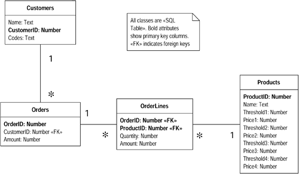
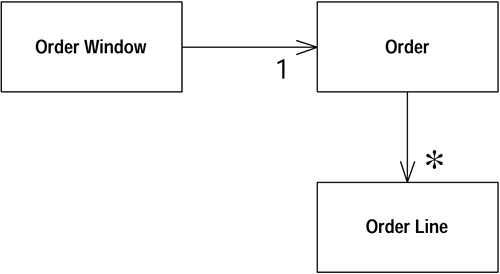
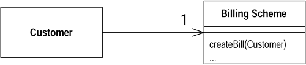

## 梳理并分解继承体系
--------------------

某个继承体系（inheritance hierarchy ）同时承担两项责任。

***建立两个继承体系，并通过委托关系（delegation）让其中一个可以调用另一个。***



**动机（Motivation）**

继承是个好东西，它使你得以在subclass 中写出明显「压缩过」（compressed）的 代码。函数的重要性可能并不和它的大小成比例——在继承体系之中尤然。

不过，先别急着为这个强大的工具欢呼雀跃，因为继承也很容易被误用，并且这种误用还很容易在开发人员之间蔓延。今天你为了一项小小任务而加入一个小小的subclass ；明天又为同样任务在继承体系的另一个地方加入另一个subclass 。一个星期（或者一个月或者一年）之后，你就会发现自己身陷泥淖，而且连一根拐杖都没有。

混乱的继承体系是一个严重的问题，因为它会导致重复代码，而后者正是程序员生涯的致命毒药。它还会使修改变得困难，因为「特定种类」的问题的解决策略被分散到了整个继承体系。最终，你的代码将非常难以理解。你无法简单地说：『这就 是我的继承体系，它能计算结果』，而必须说：『它会计算出结果……呃，这些是 用以表现不同表格形式的subclasses ，每个subclass 又有一些subclasses 针对不同的 国家。』

要指出「某个继承体系承担了两项不同的责任」并不困难：如果继承体系中的某一特定层级上的所有classes，其subclass 名称都以相同的形容词开始，那么这个体系很可能就是承担着两项不同的责任。

**作法（Mechanics）**

- 首先识别出继承体系所承担的不同责任，然后建立一个二维表格（或者三维乃至四维表格，如果你的继承体系够混乱而你的绘图工具够酷的话），并以坐标轴标示出不同的任务。我们将重复运用本重构，处理两个或两个以上的维度〔当然，每次只处理一个维度〉。
- 判断哪一项责任更重要些，并准备将它留在当前的继承体系中。准备将另一项责任移到另一个继承体系中。
- 使用[提炼类](moving-features-between-objects.md#_1) 从当前的superclass 提炼出一个新class ，用以表示重要性稍低的责任，并在原superclass 中添加一个instance 变量（不是static 变量〕，用以保存新建class 的实体。
- 对应于原继承体系中的每个subclass ，创建上述新class 的一个个subclasses 。在原继承体系的subclasses 中，将前一步骤所添加的instance 变量初始化为新建subclass 的实体。
- 针对原继承体系中每个subclass ，使用[搬移函数](moving-features-between-objects.md#_3) 将其中的行为搬移到与之对应的新建subclass 中。
- 当原继承体系中的某个subclass 不再有任何代码时，就将它去除。
- 重复以上步骤，直到原继承体系中的所有subclass 都被处理过为止。观察新继承体系，看看是否有可能对它实施其他重构手法，例如[函数上移](dealing-with-generalization.md#_8)或[值域上移](dealing-with-generalization.md#_7)。


**范例：（Example）**

让我们来看一个混乱的继承体系（如图12.1）。


图12.1  一个混乱的继承体系


这个继承体系之所以混乱，因为一开始Deal class 只被用来显示单笔交易。后来，某个人突发奇想地用它来显示一张交易表格。只需飞快建立一个ActiveDeal subclass 再加上一点点经验，不必做太多工作就可以显示一张表格了。哦，还要「被动交易（PassiveDeal）」表格是吗？没问题，再加一个subclass 就行了。

两个月过去，表格相关代码变得愈来愈复杂，你却没有一个好地方可以放它们，因为时间太紧了。咳，老戏码！现在你将很难向系统加入新种交易，因为「交易处理逻辑」与「数据显示逻辑」已经「你中有我，我中有你」了。

按照本重构提出的处方笺，第一步工作是识别出这个继承体系所承担的各项责任。 这个继承体系的职责之一是捕捉不同交易种类间的变化（差异〕，职责之二是捕捉 不同显示风格之间的变化（差异〕。因此，我们可以得到下列表格：

Deal | Active Deal | Passive Deal
---- | ----------- | ------------
Tabular


下一步要判断哪一项职责更重要。很明显「交易种类」比「显示风格」重要，因此我们把「交易种类」留在原地，把「显示风格」提炼到另一个继承体系中。不过，实际工作中，我们可能需要将「代码较多」的职责留在原地，这样一来需要搬移的 代码数量会比较少。

然后，我们应该使用[提炼类](moving-features-between-objects.md#_1) 提炼出一个单独的PresentationStyle class 用以表示「显示风格」（如图12.2）。


图12.2  添加PresentationStyle ，用以表示「显示风格」

接下来我们需要针对原继承体系中的每个subclass ，建立PresentationStyle 的一个个subclasses （如图 12.3），并将Deal class之中用来保存PresentationStyle 实体的那个instance 变量初始化为适当的subclass 实体：


图12.3  为PresentationStyle 添加subclasses


```java
ActiveDeal constructor
  ...presentation= new SingleActivePresentationStyle();...
``` 
  

你可能会说：『这不是比原先的classes 数量还多了吗？难道这还能让我的生活更舒服？』生活往往如此：以退为进，走得更远。对一个纠结成团的继承体系来说，被提炼出来的另一个继承体系几乎总是可以再戏剧性地大量简化。不过，比较安全的态度是一次一小步，不要过于躁进。

现在，我们要使用 [搬移函数](moving-features-between-objects.md#_3) 和 [搬移值域](moving-features-between-objects.md#_2)，将Deal subclass 中[与显示逻辑相关」的函数和变量搬移到PresentationStyle 相应的subclasses 去。我们想不出什么好办法来模拟这个过程，只好请你自己想像。总之，这个步骤完成后，TabularActiveDeal 和 TabularPassiveDeal不再有任何代码，因此我们将它们移除（如图12.4）。




图12.4  与表格相关的 Deal subclass 都移除了


两项职责被分割之后，我们可以分别简化两个继承体系。一旦本重构完成，我们总是能够大大简化被提炼出来的新继承体系，而且通常还可以简化原继承体系。

下一步，我们将摆脱「显示风格」中的主动（active）与被动（passive）区别，如图 12.5。


图12.5  继承体系被分割了


就连「单一显示」和「表格显示」之间的区别，都可以运用若干变量值来捕捉，根本不需要为它们建立subclasses （如图12.6〕。


图12.6「显示风格」（presentation style）之间的差异可以使用一些变量来表现

## 将过程化设计转化为对象设计
-------------------------


你手上有一些代码，以传统的过程化风格（procedural style）写就。

**将数据记录（data records）<sup>9</sup> 变成对象，将行为分开，并将行为移入相关对象之中。**

<i><sup>9</sup>译注：这里所谓的记录（record），是指像C struct 那样的结构。</i>


**动机（Motivation）**

有一次，我们的一位客户，在项目开始时，给开发者提出了两条必须遵守的条件：（1）必须使用Java；（2）不能使用对象。

这让我们忍俊不禁。尽管是面向对象语言，「使用对象」可远不仅仅是「调用构造函数」而已。对象的使用也需要花时间去学习。往往你会面对一些过程化风格（procedural style）的代码所带来的问题，并因而希望它们变得更面向对象一些。 典型的情况是：class 中有着长长的过程化函数和极少的数据，以及所谓的「哑数据 对象」——除了数据访问函数（accessors）外没有其他任何函数。如果你要转换的是一个纯粹的过程化程序（procedural program），可能连这些东西都没有。

我们并不是说绝对不应该出现「只有行为而几乎没有数据」的对象。在Strategy 模式中，我们常常使用一些小型的strategy 对象来改变宿主对象的行为，这些小型的strategy 对象就是「只有行为而没有数据」。但是这样的对象通常比较小，而且只有在我们特规需要灵活性的时候，才会使用它们。


**作法（Mechanics）**
- 针对每一个记录型别（record type），将它转变为「只含访问函数」的「哑数据对象』（dump data object ）。
  - 如果你的数据来自关系式数据库（relational database），就把数据库中的每个表（table）变成一个「哑数据对象」。
- 针对每一处过程化风格，将该处的代码提炼到一个独立class 中。
  - 你可以把提炼所得的class 做成一个Singleton（单件；为了方便重新初始化），或是把提炼所得的函数声明为static。
- 针对每一个长长的程序（procedure），实施[提炼函数](composing-methods.md#_1)及其他相关重构，将它分解。再以[搬移函数](moving-features-between-objects.md#_3) 将分解后的函数分别移到它所相关的哑数据类（dump data class）中。
- 重复上述步骤，直到原始中的所有函数都被移除。如果原始是一个完全过程化（purely procedural〕的class ，将它拿掉将大快人心。


**范例：（Example）**

第1章的范例很好地展示了[将过程化设计转化为对象设计](big-refactorings.md#_2)，尤其是第一阶段（对statement() 函数的分解和安置）。完成这项重构之后，你就拥有了一个「聪明的」数据对象，可以对它进行其他种重构了。 

## 将领域和表述/显示分离
-----------------------

<i>（译注：本节保留domain-，presentation-logic，UI，class，object等英文词）</i>

某些GUI class 之中包含了domain logic（领域逻辑）。

**将domain logic（领域逻辑）分离出来，为它们建立独立的domain class。**




**动机（Motivation）**

提到面向对象，就不能不提model-view-controller （MVC，模型-视图-控制器） 模式。在Smalltalk-80环境中，人们以此模式维护GUI（图形用户界面）和domain object （领域对象）间的关系。

MVC模式的最核心价值在于：它将用户界面代码（即所谓view，视图；亦即现今常说的presentation，表述）和领域逻辑（即所谓model，模型）分离了。presentation class 只含用以处理用户界面的逻辑；domain class不含任何与程序外观相关的代码，只含业务逻辑（business logic）相关代码。将程序中这两块复杂的部分加以分离，程序未来的修改将变得更加容易，同时也使同一业务逻辑（business logic）的多种表述（显示）方式成为可能。那些熟稔面向对象技术的程序员会毫不犹豫地在他们的程序中进行这种分离，并且这种作法也的确证实了它自身的价值。

但是，大多数人并没有在设计中采用这种方式来处理GUI。大多数带有client-server GUIs 的环境都釆用双层（two-tier）逻辑设计：数据保存在数据库中，业务逻辑（business logic）放在presentation class 中。这样的环境往往迫使你也倾向这种风格的设计，使你很难把业务逻辑放在其他地方。

Java 是一个真正意义上的面向对象环境，因此你可以创建内含业务逻辑的非视觉性领域对象（nonvisual domain objects ）。但你却还是会经常遇到上述双层风格写就的程序。


**作法（Mechanics）**

- 为每个窗口（window）建立一个domain class。
- 如果窗口内有一张表格（grid），新建一个class 来表示其中的行（row），再以窗口所对应之domain class 中的一个群集（collection）来容纳所有的row domain objects。
- 检查窗口中的数据。如果数据只被用于UI，就把它留着；如果数据被domain logic使用，而且不显示于窗口上，我们就以Mocve Field 将它搬移到domain class 中；如果数据同时被UI 和domain logic 使用，就对它实施[复制被监视数据](organizing-data.md#_5)，使它同时存在于两处，并保持两处之间的同步。
-  检査presentation class 中的逻辑。实施 [提炼函数](composing-methods.md#_1) 将presentation logic 从domain logic 中分开。一旦隔离了domain logic。再运用 [搬移函数](moving-features-between-objects.md#_3) 将它移到domain class。
- 以上步骤完成后，你就拥有了两组彼此分离的classes：presentation classes 用以处理GUI，domain logic 内含所有业务逻辑（business logic）。此时的domain classes 组织可能还不够严谨，更进一步的重构将解决这些问题。


**范例：（Example）**

下面是一个商品订购程序。其GUI 如图12.7所示，其presentation class 与图12.8 所示的关系式数据库（relational database）互动。



图12.7  启动程序的用户界面



图12.8  订单程序所用的数据库

* 所有classes 都是《SQL table》，粗体字表示主键（primary key），《FK》表示外键（foreign keys）


所有行为（包括GUI 和定单处理）都由OrderWindow class 处理。

首先建立一个Order class 表示「定单」。然后把Order 和OrderWindow 联系起来， 如图12.9。由于窗口中有一个用以显示定单的表格（grid），所以我们还得建立一个OrderLine，用以表示表格中的每一行（rows）。




图12.9  OrderWindow class 和Order class


我们将从窗口这边而不是从数据库那边开始重构。当然，一开始就把domain model 建立在数据库基础上，也是一种合理策略，但我们最大的风险源于presentation logic 和domain logic之间的混淆，因此我们首先基于窗口将这些分离出来，然后再考虑对其他地方进行重构。

面对这一类程序，在窗口中寻找内嵌的SQL （结构化查询语言）语句，会对你有所帮助，因为SQL 语句获取的数据一定是domain data 。

最容易处理的domain data 就是那些不直接显示于GUI 者。本例数据库的Customer table 中有一个Codes 值域，它并不直接显示于GUI，而是被转换为一个更容易被人理解的短语之后再显示。程序中以简单型别（而非AWT组件）如String 保存这个值域值。我们可以安全地使用[搬移值域](moving-features-between-objects.md#_2) 将这个值域移到domain class。

对于其他值域，我们就没有这么幸运了，因为它们内含AWT 组件，既显示于窗口， 也被domain object 使用。面对这些值域，我们需要使用[复制被监视数据](organizing-data.md#_5)，把一个domain field 放进Order class，又把一个相应的AWT field 放进OrderWindow class。

这是一个缓慢的过程，但最终我们还是可以把所有domain logic field 都搬到domain class。进行这一步骤时，你可以试着把所有SQL calls 都移到domain class，这样你就是同时移动了database logic 和domain data。最后，你可以在OrderWindow 中移除import java.sql 之类的语句，这就表示我们的重构告一段落了。在此阶段中 你可能需要大量运用 [提炼函数](composing-methods.md#_1) 和 [搬移函数](moving-features-between-objects.md#_3)。

现在，我们拥有的三个classes，如图12.10所示，它们离「组织良好」还有很大的距离。不过这个模型的确已经很好地分离了presentation logic 和domain logic （business logic）。本项重构的进行过程中，你必须时刻留心你的风险来自何方。 如果「presentation logic 和domain logic 混淆」是最大风险，那么就先把它们完全分开，然后才做其他工作；如果其他方面的事情（例如产品定价策略〉更重要，那么就先把那一部分的logic 从窗口提炼出来，并围绕着这个高风险部分进行重构，为它建立合适的结构。反正domain logic 早晚都必须从窗口移出，如果你在处理高风险部分的重构时会遗留某些logic 于窗口之中，没关系，就放手去做吧。


图12.10  将数据安置（分散）于domain classes 中

## 提炼继承体系
--------------


你有某个class 做了太多（过多〕工作，其中一部分工作是以大量条件式完成的。

**建立继承体系，以一个subclass 表示一种特殊情况。**


**动机（Motivation）**

在渐进式设计过程中，常常会有这样的情况：一开始设计者只想「以一个class 实 现一个概念」；但随着设计方案的演化，最后却可能「一个class 实现了两个、三 个乃至十个不同的概念」。一开始，你建立了这个简单的class ；数天或数周之后， 你可能发现：只要加入一个标记（flag）和一两个测试，就可以在另一个环境下使用这个class ；一个月之后你又发现了另一个这样的机会；一年之后，这个class 就完全一团糟了：标记变量和条件式遍布各处。

当你遇到这种「瑞士小刀般」的class ，不但能够开瓶开罐、砍小树枝、在演示文稿会上打出激光强调重点……（简直无所不能），你就需要一个好策略（亦即本项重构、将它的各个功能梳理并分开。不过，请注意，只有当条件逻辑（conditional logic）在对象的整个生命期间保持不变，本重构所导入的策略才适用。否则你可能必须在分离各种状况之前先使用[提炼类](moving-features-between-objects.md#_1)。

[提炼继承体系](big-refactorings.md#_4)是一项大型重构，如果你一天之内不足以完成它，不要因此失去勇气。将一个极度混乱的设计方案梳理出来，可能需要数周甚至数月的时间。 你可以先进行本重构中的一些简易步骤，稍微休息一下，再花数天编写一些明显有生产力的代码。当你领悟到更多东西，再回来继续本项重构的其他步骤——这些步骤将因为你的领悟而显得更加简单明了。


**作法（Mechanics）**

我们为你准备了两组重构作法。第一种情况是：你无法确定变异（variations）应该是些什么（也就是说你无法确定原始class 中该有哪些条件逻辑〕。这时候你希望每次一小步地前进：


- 鉴别出一种变异（variation）。
  - 如果这种变异可能在对象生命期内发生变化，就运用[提炼类](moving-features-between-objects.md#_1) 将它提炼为一个独立的class 。
- 针对这种变异，新建一个subclass ，并对原始class 实施[以工厂函数取代构造函数](making-method-calls-simpler.md#_10)。再修改factory method，令它返回适当的（相应的）subclass 实体。
- 将含有条件逻辑的函数，一次一个，遂一拷贝到subclass ，然后在明确情况下 （注：对subclass 明确，对superclass 不明确！），简化这些函数。
  - 如有必要隔离函数中的「条件逻辑」和「非条件逻辑」，可对superclass 实施[提炼函数](composing-methods.md#_1)。
- 重复上述过程，将所有变异（variations；特殊情况）都分离出来，直到可以将superclass 声明为抽象类（abstract class）为止。
- 删除superclass 中的那些「被所有subclasses 覆写」的函数（的本体），并将 它声明为抽象函数（abstract class）。


如果你非常清楚原始class 会有哪些变异（variations），可以使用另一种作法：


- 针对原始class 的每一种变异（variation）建立一个subclass 。
- 使用[以工厂函数取代构造函数](making-method-calls-simpler.md#_10) 将原始过class 的构造函数转变成factory method ，并令它针对每一种变异返回适当的subclass 实体。
  
  - 如果原始class 中的各种变异是以type code 标示，先使用 [以子类取代型别码](organizing-data.md#_14) ；如果那些变异在对象生命期间会改变， 请使用[以State/Strategy取代型别码](organizing-data.md#statestrategy)。
  
  - 针对带有条件逻辑的函数，实施 [以多态取代条件式](simplifying-conditional-expressions.md#_6)。如果并非整个函数的行为有所变化，而只是函数一部分有所变化，请先运用 [提炼函数](composing-methods.md#_1) 将变化部分和不变部分隔开来。


**范例：（Example）**

这里所举的例子是「变异并不明朗」的情况。你可以在 [以子类取代型别码](organizing-data.md#_14)、[以State/Strategy取代型别码](organizing-data.md#statestrategy) 和 [以多态取代条件式](simplifying-conditional-expressions.md#_6) 等重构结果之上，验证「变异已经明朗」的情况下如何使用本项重构。

我们以一个电费计算程序为例。这个程序有两个classes ：表示「消费者」的Customer 和表示「计费方案」的BillingScheme，如图12.11。




图12.11  Customer 和BillingScheme


BillingScheme 使用大量条件逻辑来计算不同情况（变异）下的费用：冬季和夏季的电价不同，私宅用电、小型企业用电、社会救济（包括残障人士）用电的价格也不同。这些复杂的逻辑导致BillingScheme 变得复杂。

第一个步骤是，提炼出条件逻辑中经常出现的某种变异性。本例之中可能是「视用户是否为残障人士」而发生的变化。用于标示这种情况的可能是Customer、 BillingScheme 或其他地方的一个标记变量（flag）。

我们针对这种变异建立一个subclass 。为了使用这个subclass ，我们需要确保它被建立并且被使用。因此我们需要处理BillingScheme 构造函数：首先对它实施 [以工厂函数取代构造函数](making-method-calls-simpler.md#_10)，然后在所得的factory method 中为残障 人士增加一个条件子句，使它在适当时候返回一个DisablityBillingScheme对象。

然后，我们需要观察BillingScheme 的其他函数，寻找那些随着「用户是否为残障人士」而变化的行为。createBill() 就是这样一个函数，因此我们将它拷贝到subclass （图 12,12）。


图12.12  为「残障人士」添加一个subclass

现在，我们需要检查subclass 中的createBill() 函数。由于现在我们可以肯定该 消费者是残障人士，因此可以简化这个函数。所以下列代码：
```java
if (disabilityScheme()) doSomething
```

可以变成：
```java
doSomething
```


如果规定在「残障人士用电」和「企业用电」之间只能择一，那么我们的方案就可以避免在BusinessBillingScheme 中出现任何条件代码。

实施本项重构时，我们希望将「可能变化」和「始终不变」的部分分开，为此我们可以使用 [提炼函数](composing-methods.md#_1) 和[分解条件式](simplifying-conditional-expressions.md#_3)。本例将对BillingScheme 各函数实施这两项重构，直到「是否为残障人士」的所有判断都得到了适当处理。然后我们再以相同过程处理他种变异（例如「社会救济用电」）。

然而，当我们处理第二种变异时，我们应该观察「社会救济用电」与「残障人士用 电」有何不同。我们希望能够为不同的变异（特殊情况）建立起这般函数：有着相同意图，但针对不同的变异性（特殊情况）釆取不同的实际作为（译注：这就是Template Method）。例如上述两种变异情况下的税额计算可能不同。我们希望确保两个subclasses 中的相应函数有相同的签名式（signature）。这可能意味我们必须修改DisablityBillingScheme，使得以将subclasses 整理一番。通常我们发现，面对更多变异时，这种「相仿之中略带变化」的函数（similar and varying methods patterns）会使整个系统结构趋于稳定，使我们更容易添加后续更多变异。
