## 折叠继承关系
---

superclass 和subclass 之间无太大区别。

**将它们合为一体。**

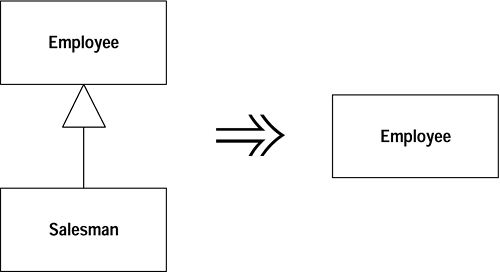


**动机（Motivation）**

如果你曾经编写过继承体系，你就会知道，继承体系很容易变得过分复杂。所谓重构继承体系，往往是将函数和值域在体系中上下移动。完成这些动作后，你 很可能发现某个subclass 并未带来该有的价值，因此需要把classes 并合（折叠）起来。


**作法（Mechanics）**

- 选择你想移除的class ：是superclass 还是subclass ？
- 使用[值域上移](dealing-with-generalization.md#_7)和[函数上移](dealing-with-generalization.md#_8)，或者[函数下移](dealing-with-generalization.md#_10)和[值域下移](dealing-with-generalization.md#_9)，把想要移除的class 内的所有行为和数据 （值域）搬移到另一个class 。
- 每次移动后，编译并测试。
- 调整「即将被移除的那个class 」的所有引用点，令它们改而引用合并（折叠）后留下的class 。这个动作将会影响变量的声明、参数的型别以及构造函数。
- 移除我们的目标；此时的它应该已经成为一个空类（empty class）。
- 编译，测试。

## 提炼接口
---

若干客户使用class 接口中的同一子集；或者，两个classes 的接口有部分相同。

**将相同的子集提炼到一个独立接口中。**


**动机（Motivation）**

classes 之间彼此互用的方式有若干种。「使用一个class 」通常意味覆盖该class 的所有责任区（ whole area of responsibilities ）。另一种情况是，某一组客户只使用class 责任区中的一个特定子集。再一种情况则是，class 需要与「所有可协助处理某些特定请求」的classes 合作。

对于后两种情况，将「被使用之部分责任」分离出来通常很有意义，因为这样可以使系统的用法更清晰，同时也更容易看清系统的责任划分。如果新的需要支持上述子集，也比较能够看清子集内有些什么东西。

在许多面向对象语言中，这种「责任划分」能力是通过多重继承（multiple inheritance）支持的。你可以针对一段行为（each segment of behavior ）建立一个class ，再将它们组合于一份实现品（implementation）中。Java 只提供单一继承（single inher），但你可以运用interfaces  (接口〉来昭示并实现上述需求。interfaces 对于Java 程序的设计方式有着巨大的影响，就连Smalltalk 程序员都认为interfaces （接口） 是一大进步！

[提炼超类](dealing-with-generalization.md#_4)和[提炼接口](dealing-with-generalization.md#_2)之间有些相似之处。[提炼接口](dealing-with-generalization.md#_2)只能提炼共通接口，不能提炼共通代码。使用[提炼接口](dealing-with-generalization.md#_2)可能造成难闻的「重复」臭味，幸而你可以运用[提炼类](moving-features-between-objects.md#_1) 先把共通行为放进一个组件（component）中，然后将工作委托（delegating）该组件，从而解决这个问题。如果有不少共通行为，[提炼超类](dealing-with-generalization.md#_4) 会比较简单，但是每个class 只能有一个superclass（译注：每个class 却能有多个interfaces ）。

如果某个class 在不同环境下扮演截然不同的角色，使用interface （接口）就是个好主意。你可以针对每个角色以[提炼接口](dealing-with-generalization.md#_2)提炼出相应接口。另一种可以用上[提炼接口](dealing-with-generalization.md#_2)的情况是：你想要描述一个class 的外驶接口（outbound interface ），亦即这个class 对其server 所进行的操作〉。如果你打算将来加入其他种类的server ，只需要求它们实现这个接口即可。


**作法（Mechanics）**

- 新建一个空接口（empty interface ）。
- 在接口中声明「待提炼类」的共通操作。
- 让相关的胡实现上述接口。
- 调整客户端的型别声明，使得以运用该接口。


**范例：（Example）**

TimeSheet class 表示「月报表」，其中将计算花在员工身上的费用。为了计算这笔费用，TimeSheet 需要知道员工级别，以及该员工是否有特殊技能：
```java
double charge(Employee emp, int days) {
    int base =  emp.getRate() * days;
    if (emp.hasSpecialSkill())
        return base * 1.05;
    else return base;
}
```      


除了提供员工的索费级别和特殊技能信息外，Employee 还有很多其他方面的功能，但本应用程序只需这两项功能。我可以针对这两项功能定义一个接口，从而强调「我 只需要这部分功能」的事实：

```java
interface Billable {
    public int getRate();
    public boolean hasSpecialSkill();
}
```   
    

然后，我声明Employee 实现这个接口 ：

```java
class Employee implements Billable ...
```  
    

完成以后，我可以修改charge() 函数声明，强调该函数只使用Employee 的这部分行为：

```java
double charge(Billable emp, int days) {
    int base =  emp.getRate() * days;
    if (emp.hasSpecialSkill())
        return base * 1.05;
    else return base;
}
```     


此刻，我们只不过是在文档化（documentability）方面获得了一些适度收获。对函 数，这样的收获并没有太大价值；但如果有若干classes 都使用Billable 接口，它就会很有用。如果我还想计算计算器租金，巨大的收获就显露出来了。为了让公司里的计算器都「能够被计费」（billable），我只需让Computer class 实现Billable 接口，然后就可以把计算器租金登记到月报表上了。
## 提炼子类
---

class 中的某些特性（features）只被某些（而非全部）实体（instances）用到。

**新建一个subclass ，将上面所说的那一部分特性移到subclass 中。**
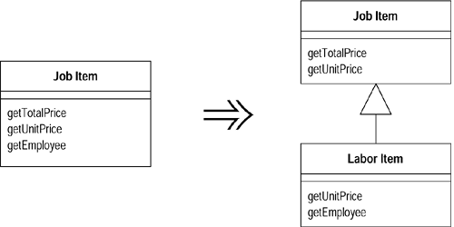


**动机（Motivation）**

使用[提炼子类](dealing-with-generalization.md#_3)的主要动机是：你发现class 中的某些行为只被一部分实体用到，其他实体不需要它们。有时候这种行为上的差异是通过type code 区分 的，此时你可以使用[以子类取代型别码](organizing-data.md#_14)或[以State/Strategy取代型别码](organizing-data.md#statestrategy)。但是，并非一定要出现了type code 才表示需要考虑使用subclass 。

[提炼类](moving-features-between-objects.md#_1) 是[提炼子类](dealing-with-generalization.md#_3) 之外的另一种选择，两者之间的抉择其实就是委托（delegation）和继承（inheritance）之间的抉择。[提炼子类](dealing-with-generalization.md#_3)通常更容易进行，但它也有限制：一旦对象创建完成，你无法再改变「与型别相关的行为」（class-based behavior ）。但如果使用[提炼类](moving-features-between-objects.md#_1) ，你只需插入另一个不同组件（ plugging in different components）就可以改变对象的行为。此外，subclasses 只能用以表现一组变化（one set of variations）。如果你希望class 以数种不同的方式变化，就必须使用委托（delegation）。


**作法（Mechanics）**

  - 为source class 定义一个新的subclass 。
  - 为这个新的subclass 提供构造函数。
    - 简单的作法是：让subclass 构造函数接受与superclass 构造函数相同的参数，并通过super 调用superclass 构造函数。
    - 如果你希望对用户隐藏subclass 的存在，可使用[以工厂函数取代构造函数](making-method-calls-simpler.md#_10)。
  - 找出调用superclass 构造函数的所有地点。如果它们需要的是新建的subclass ， 令它们改而调用新构造函数。
    - 如果subclass 构造函数需要的参数和superclass 构造函数的参数不同，可以使用[重新命名函数](making-method-calls-simpler.md#_9) 修改其参数列。如果subclass 构造函数不需要superclass 构造函数的某些参数，可以使用[重新命名函数](making-method-calls-simpler.md#_9) 将它们去除。
    - 如果不再需要直接实体化（具现化，instantiated）superclass ，就将它声明为抽象类。
  - 逐一使用[函数下移](dealing-with-generalization.md#_10) 和 [值域下移](dealing-with-generalization.md#_9) 将source class 的特性移到subclass 去。
    - 和[提炼类](moving-features-between-objects.md#_1) 不同的是，先处理函数再处理数据，通常会简单一些。
    - 当一个public 函数被下移到subclass 后，你可能需要重新定义该函数的调用端的局部变量或参数型别，让它们改调用subclass 中的新函数。如果忘记进行这一步骤，编译器会提醒你。
  - 找到所有这样的值域：它们所传达的信息如今可由继承体系自身传达（这一类值域通常是boolean 变量或type code ）。以[封装值域](organizing-data.md#_7)避免直接使用这些值域，然后将它们的取值函数（getter）替换为多态常量函数（polymorphic constant methods）。所有使用这些值域的地方都应该以[以多态取代条件式](simplifying-conditional-expressions.md#_6) 重构。
    - 任何函数如果位于source class 之外，而又使用了上述值域的访问函数（accessors），考虑以 [搬移函数](moving-features-between-objects.md#_3) 将它移到source class 中， 然后再使用[以多态取代条件式](simplifying-conditional-expressions.md#_6)。
  - 每次下移之后，编译并测试。
  
  

**范例：（Example）**

下面是JobItem class，用来决定当地修车厂的工作报价：
```java
class JobItem ...
    public JobItem (int unitPrice, int quantity, boolean isLabor, Employee employee) {
        _unitPrice = unitPrice;
        _quantity = quantity;
        _isLabor = isLabor;
        _employee = employee;
    }
    public int getTotalPrice() {
        return getUnitPrice() * _quantity;
    }
    public int getUnitPrice(){
        return (_isLabor) ?
        _employee.getRate():
        _unitPrice;
    }
    public int getQuantity(){
        return _quantity;
    }
    public Employee getEmployee() {
        return _employee;
    }
    private int _unitPrice;
    private int _quantity;
    private Employee _employee;
    private boolean _isLabor;

class Employee...
    public Employee (int rate) {
        _rate = rate;
    }
    public int getRate() {
        return _rate;
    }
    private int _rate;
```


我要提炼出一个LaborItem subclass，因为上述某些行为和数据只在labor (劳工） 情况下才需要。首先建立这样一个class：
```java
class LaborItem extends JobItem {}
```


我需要为LaborItem 提供一个构造函数，因为JobItem 没有「无引数构造函数」 （ no-arg constructor）。我把superclass 构造函数的参数列拷贝过来：
```java
public LaborItem (int unitPrice, int quantity, boolean isLabor, Employee employee) {
    super (unitPrice, quantity, isLabor, employee);
}
```   
   

这就足以让新的subclass 通过编译了。但是这个构造函数会造成混淆：某些参数是LaborItem 所需要的，另一些不是。稍后我再来解决这个问题。

下一步是要找出对JobItem 构造函数的调用，并从中找出「可替换为LaborItem 构造函数」者。因此，下列语句：
```java
JobItem j1 = new JobItem (0, 5, true, kent);
```       
       

就被修改为：
```java
JobItem j1 = new LaborItem (0, 5, true, kent);
```
       

此时我尚未修改变量型别，只是修改了构造函数所属的class 。之所以这样做，是因为我希望只在必要地点才使用新型别。到目前为止，subclass 还没有专属接口，因 此我还不想宣布任何改变。

现在正是清理构造函数参数列的好时机。我将针对每个构造函数使用[重新命名函数](making-method-calls-simpler.md#_9)。首先处理superclass 构造函数。我要新建一个构造函数，并把旧构造函数声明为protected （不能直接声明为private ，因为subclass 还需要它）：
```java
class JobItem...
    protected JobItem (int unitPrice, int quantity, boolean isLabor, Employee employee) {
        _unitPrice = unitPrice;
        _quantity = quantity;
        _isLabor = isLabor;
        _employee = employee;
    }
    public JobItem (int unitPrice, int quantity) {
        this (unitPrice, quantity, false, null)
    }
```      


现在，外部调用应该使用新构造函数：
```java
JobItem j2 = new JobItem (10, 15);
```       


编译、测试都通过后，我再使用 [重新命名函数](making-method-calls-simpler.md#_9) 修改subclass 构造函数：
```java
class LaborItem
    public LaborItem (int quantity, Employee employee) {
        super (0, quantity, true, employee);
    }
```      
      

此时的我仍然暂时使用protected superclass 构造函数。

现在，我可以将JobItem 的特性向下搬移。先从函数幵始，我先运用 [函数下移](dealing-with-generalization.md#_10) 对付getEmployee() 函数：
```java
class LaborItem...
    public Employee getEmployee() {
        return _employee;
    }
class JobItem...
    protected Employee _employee;
```      
      

因为_employee 值域也将在稍后被下移到LaborItem ，所以我现在先将它声明为protected。

将_employee 值域声明protected 之后，我可以再次清理构造函数，让_employee 只在「即将去达的subclass 中」被初始化：
```java
class JobItem...
    protected JobItem (int unitPrice, int quantity, boolean isLabor) {
        _unitPrice = unitPrice;
        _quantity = quantity;
        _isLabor = isLabor;
    }
class LaborItem ...
    public LaborItem (int quantity, Employee employee) {
        super (0, quantity, true);
        _employee = employee;
    }
```
      

_isLabor 值域所传达的信息，现在已经成为继承体系的内在信息，因此我可以移 除这个值域了。最好的方式是：先使用[封装值域](organizing-data.md#_7)，然后再修改访问函数（accessors），改用多态常量函数。所谓「多态常量函数」会在不同的subclass 实现版本中返回不同的固定值：
```java
class JobItem...
    protected boolean isLabor() {
        return false;
    }
class LaborItem...
    protected boolean isLabor() {
        return true;
    }
```      


然后，我就可以摆脱_isLabor 值域了。

现在，我可以观察isLabor() 函数的用户，并运用[以多态取代条件式](simplifying-conditional-expressions.md#_6) 重构它们。我找到了下列这样的函数：

```java
class JobItem...
    public int getUnitPrice(){
        return (isLabor()) ? _employee.getRate(): _unitPrice;
    }
```


将它重构为：

```java
class JobItem...
    public int getUnitPrice(){
        return _unitPrice;
    }
class LaborItem...
    public int getUnitPrice(){
        return  _employee.getRate();
    }
```


当使用某项值域的函数全被下移至subclass 后，我就可以使用 [值域下移](dealing-with-generalization.md#_9) 将值域也下移。如果尚还无法移动值域，那就表示，我需要对函数做更多处理，可能需要实施[函数下移](dealing-with-generalization.md#_10) 或 [以多态取代条件式](simplifying-conditional-expressions.md#_6)。

由于_unitPrice 值域只被LaborItem 以外的对象（也就是parts job items）所用， 所以我可以再次运用[提炼子类](dealing-with-generalization.md#_3) 对JobItem 提炼出一个subclass ：PartsItem 。完成后，我可以将JobItem 声明为抽象类。


## 提炼超类
---

两个classes 有相似特性（similar features）。

**为这两个classes 建立一个superclass ，将相同特性移至superclass 。**


**动机（Motivation）**

重复代码是系统中最主要的一种糟糕东西。如果你在不同的地方进行相同一件事 情，一旦需要修改那些动作时，你就得负担比你原本应该负担的更多事情。

重复代码的某种形式就是：两个classes 以相同的方式做类似的事情，或者以不同的方式做类似的事情。对象提供了一种简化这种情况的机制，那就是继承机制。但是，在建立这些具有共通性的classes 之前，你往往无法发现这样的共通性，因此你经常会在「具有共通性」的classes 存在之后，再幵始建立其间的继承结构。

另一种选择就是[提炼类](moving-features-between-objects.md#_1)。这两种方案之间的选择其实就是继承（Inheritance ）和委托（delegation）之间的选择。如果两个classes 可以共享行为， 也可以共享接口，那么继承是比较简单的作法。如果你选错了，也总有[以委托取代继承](dealing-with-generalization.md#_12)这瓶后悔药可吃。


**作法（Mechanics）**

- 为原本的classes 新建一个空白的abstract superclass。
- 运用[值域上移](dealing-with-generalization.md#_7), [函数上移](dealing-with-generalization.md#_8), 和[构造函数本体上移](dealing-with-generalization.md#_6)逐一将subclass 的共同充素上移到superclass 。
    - 先搬移值域，通常比较简单。
    - 如果相应的subclass 函数有不同的签名式（signature），但用途相同，可以先使用[重新命名函数](making-method-calls-simpler.md#_9) 将它们的签名式改为相同，然后 再使用 [函数上移](dealing-with-generalization.md#_8)。
    - 如果相应的subclass 函数有相同的签名式，但函数本体不同，可以在superclass 中把它们的共同签名式声明为抽象函数。
    - 如果相应的subclass 函数有不同的函数本体，但用途相同，可试着使用 [替换你的算法](composing-methods.md#_10) 把其中一个函数的函数本体拷贝到另一个函数中。如果运转正常，你就可以使用 [函数上移](dealing-with-generalization.md#_8)。
- 每次上移后，编译并测试。
- 检查留在subclass 中的函数，看它们是否还有共通成分。如果有，可以使用[提炼函数](composing-methods.md#_1) 将共通部分再提炼出来，然后使用 [函数上移](dealing-with-generalization.md#_8) 将提炼出的函数上移到superclass 。如果各个subclass 中某个函数的整体流程很相似，你也许可以使用[塑造模板函数](dealing-with-generalization.md#_5)。
- 将所有共通元素都上移到superclass 之后，检查subclass 的所有用户。如果它们只使用共同接口，你就可以把它们所索求的对象型别改为superclass 。


    
**范例：（Example）**

下面例子中，我以Employee 表示「员工」，以Department 表示「部门」：

```java
class Employee...
    public Employee (String name, String id, int annualCost) {
        _name = name;
        _id = id;
        _annualCost = annualCost;
    }
    public int getAnnualCost() {
        return _annualCost;
    }
    public String getId(){
        return _id;
    }
    public String getName() {
        return _name;
    }
    private String _name;
    private int _annualCost;
    private String _id;

public class Department...
    public Department (String name) {
        _name = name;
    }
    public int getTotalAnnualCost(){
        Enumeration e = getStaff();
        int result = 0;
        while (e.hasMoreElements()) {
            Employee each = (Employee) e.nextElement();
            result += each.getAnnualCost();
        }
        return result;
    }
    public int getHeadCount() {
        return _staff.size();
    }
    public Enumeration getStaff() {
        return _staff.elements();
    }
    public void addStaff(Employee arg) {
        _staff.addElement(arg);
    }
    public String getName() {
        return _name;
    }
    private String _name;
    private Vector _staff = new Vector();
```     


这里有两处共同点。首先，员工和部门都有名称（names）；其次，它们都有年度成本（annual costs），只不过计算方式略有不同。我要提炼出一个superclass ，用以包容这些共通特性。第一步是新建这个superclass ，并将现有的两个classes 定义为其subclasses：

```java
abstract class Party {}
class Employee extends Party...
class Department extends Party...
```    
    

然后我开始把特性上移至superclass 。先实施[值域上移](dealing-with-generalization.md#_7) 通常会比较简单：

```java
class Party...
    protected String _name;
```     
      

然后，我可以使用 [函数上移](dealing-with-generalization.md#_8) 把这个值域的取值函数（getter）也上移至superclass ：

```java
class Party {
    public String getName() {
        return _name;
    }
```      
      

我通常会把这个值域声明为private 。不过，在此之前，我需要先使用[构造函数本体上移](dealing-with-generalization.md#_6)，这样才能对_name 正确赋值：

```java
class Party...
    protected Party (String name) {
        _name = name;
    }
    private String _name;

class Employee...
    public Employee (String name, String id, int annualCost) {
        super (name);
        _id = id;
    _annualCost = annualCost;
    }

class Department...
    public Department (String name) {
        super (name);
    }
```      


Department.getTotalAnnualCost() 和 Employee.getAnnualCost() 两个函数的用途相同，因此它们应该有相同的名称。我先运用 [重新命名函数](making-method-calls-simpler.md#_9) 把它们的名称改为相同：

```java
class Department extends Party {
    public int getAnnualCost(){
        Enumeration e = getStaff();
        int result = 0;
        while (e.hasMoreElements()) {
            Employee each = (Employee) e.nextElement();
            result += each.getAnnualCost();
        }
        return result;
    }
```      
      

它们的函数本体仍然不同，因此我目前还无法使用 [函数上移](dealing-with-generalization.md#_8)。但是我 可以在superclass 中声明一个抽象函数：

```java
abstract public int getAnnualCost()
```      
      

这一步修改完成后，我需要观察两个subclasses 的用户，看看是否可以改变它们转而使用新的superclass 。用户之一就是Department 自身，它保存了一个Employee 对象群集。Department .getAnnualCost() 只调用群集内的元素（对象）的getAnnualCost() 函数，而该函数此刻乃是在Party class 声明的：

```java
class Department...
    public int getAnnualCost(){
        Enumeration e = getStaff();
        int result = 0;
        while (e.hasMoreElements()) {
            Party each = (Party) e.nextElement();
            result += each.getAnnualCost();
        }
        return result;
    }
```     
      

这一行为暗示一种新的可能性：我可以用Composite 模式[Gang of Four] 来对待Department 和Employee ，这样就可以让一个Department 对象包容另—个Department 对象。这是一项新功能，所以这项修改严格来说不属于重构范围。如果用户恰好需要Composite 模式，我可以修改_staff 值域名字，使其更好地表现这一模式。这一修改还会带来其他相应修改：修改addStaff() 函数名称，并将该函数的参数型别改为Party class 。最后还需要把headCount() 函数变成一个递归调用。我的作法是在Employee 中建立一个headCount() 函数，让它返回1；再使用[替换你的算法](composing-methods.md#_10) 修改Department 的headCount() 函数，让它总和（add）各部门的headCount() 调用结果。


## 塑造模板函数
---

你有一些subclasses ，其中相应的某些函数以相同顺序执行类似的措施，但各措施实际上有所不同。

**将各个措施分别放进独立函数中，并保持它们都有相同的签名式（signature），于是原函数也就变得相同了。然后将原函数上移至superclass 。**

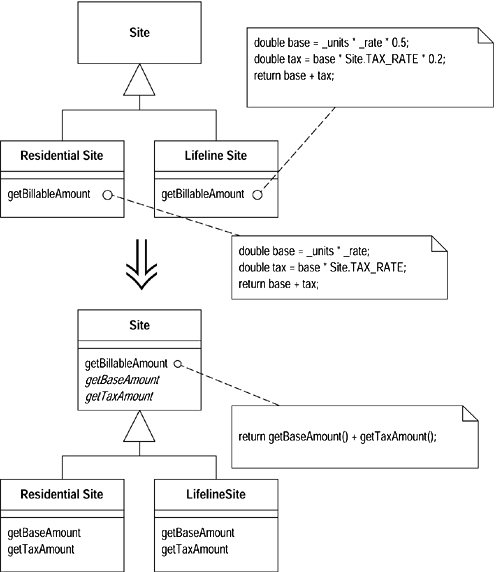


**动机（Motivation）**

继承是「避免重复行为」的一个强大工具。无论何时，只要你看见两个subclasses 之中有类似的函数，就可以把它们提升到superclass 。但是如果这些函数并不完全相同呢？此时的你应该怎么办？我们仍有必要尽量避免重复，但又必须保持这些函 数之间的实质差异。

常见的一种情况是：两个函数以相同序列（sequence）执行大致相近的措施，但是各措施不完全相同。这种情况下我们可以将「执行各措施」的序列移至superclass ， 并倚赖多态（polymorphism ）保证各措施仍得以保持差异性。这样的函数被称为Template Method （模板函数）[Gang of Four]。


**作法（Mechanics）**

- 在各个subclass 中分解目标函数，使分解后的各个函数要不完全相同，要不完全不同。
- 运用[函数上移](dealing-with-generalization.md#_8) 将各subclass 内寒全相同的函数上移至superclass 。
- 对于那些（剩余的、存在于各subclasses 内的）完全不同的函数，实施[重新命名函数](making-method-calls-simpler.md#_9)，使所有这些函数的签名式（signature）完全相同。
    - 这将使得原函数变为完全相同，因为它们都执行同样一组函数调用； 但各subclass 会以不同方式响应这些调用。
- 修改上述所有签名式后，编译并测试。
- 运用[函数上移](dealing-with-generalization.md#_8) 将所有原函数上移至superclass 。在superclass 中将那些「有所不同、代表各种不同措施」的函数定义为抽象函数。
- 编译，测试。
- 移除其他subclass 中的原函数，每删除一个，编译并测试。


**范例：（Example）**

现在我将完成第一章遗留的那个范例。在此范例中，我有一个Customer ，其中有两个用于打印的函数。statement() 函数以ASCII 码打印报表（statement）：
```java
public String statement() {
    Enumeration rentals = _rentals.elements();
    String result = "Rental Record for " + getName() + "\n";
    while (rentals.hasMoreElements()) {
        Rental each = (Rental) rentals.nextElement();
        //show figures for this rental
        result += "\t" + each.getMovie().getTitle()+ "\t" 
         + String.valueOf(each.getCharge()) + "\n";
    }
    //add footer lines
    result +=  "Amount owed is " + String.valueOf(getTotalCharge()) + "\n";
    result += "You earned " + String.valueOf(getTotalFrequentRenterPoints()) 
        + " frequent renter points";
    return result;
}
```     


函数htmlStatement() 则以HTML 格式输出报表：

```java
public String htmlStatement() {
    Enumeration rentals = _rentals.elements();
    String result = "<H1>Rentals for <EM>" + getName() + "</EM></H1>\n";
    while (rentals.hasMoreElements()) {
        Rental each = (Rental) rentals.nextElement();
        //show figures for each rental
        result += each.getMovie().getTitle()+ ": " + String.valueOf(each.getCharge()) + "\n";
    }
    //add footer lines
    result +=  "You owe <EM>" + String.valueOf(getTotalCharge()) + "</EM>\n";
    result += "On this rental you earned <EM>" 
        + String.valueOf(getTotalFrequentRenterPoints()) 
        + "</EM> frequent renter points";
    return result;
}
```    


使用 [塑造模板函数](dealing-with-generalization.md#_5) 之前，我需要对上述两个函数做一些整理，使它们成为「某个共同superclass 」下的subclass 函数。为了这一目的，我使用函数对象（method object）[Beck] 针对「报表打印工作」创建一个「独立的策略继承体系」（separate strategy hierarchy ），如图11.1。

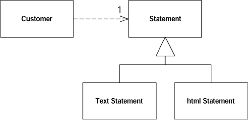
图7.1  简单的委托关系（delegation）

```java
class Statement {}
class TextStatement extends Statement {}
class HtmlStatement extends Statement {}
```   


现在，通过[搬移函数](moving-features-between-objects.md#_3)，我将两个负责输出报表的函数分别搬移到对应的subclass  中：

```java
class Customer...
    public String statement() {
        return new TextStatement().value(this);
    }
    public String htmlStatement() {
        return new HtmlStatement().value(this);
    }

class TextStatement {
    public String value(Customer aCustomer) {
        Enumeration rentals = aCustomer.getRentals();
        String result = "Rental Record for " + aCustomer.getName() + "\n";
        while (rentals.hasMoreElements()) {
            Rental each = (Rental) rentals.nextElement();

            //show figures for this rental
            result += "\t" + each.getMovie().getTitle()+ "\t" 
            + String.valueOf(each.getCharge()) + "\n";
        }

        //add footer lines
        result +=  "Amount owed is " + String.valueOf(aCustomer.getTotalCharge()) + "\n";
        result += "You earned " + String.valueOf(aCustomer.getTotalFrequentRenterPoints()) 
            + " frequent renter points";
        return result;
    }

class HtmlStatement {
    public String value(Customer aCustomer) {
        Enumeration rentals = aCustomer.getRentals();
        String result = "<H1>Rentals for <EM>" + aCustomer.getName() + "</EM></H1>\n";
        while (rentals.hasMoreElements()) {
            Rental each = (Rental) rentals.nextElement();
            //show figures for each rental
            result += each.getMovie().getTitle()+ ": " + String.valueOf(each.getCharge()) + "\n";
        }
        //add footer lines
        result +=  "You owe <EM>" + String.valueOf(aCustomer.getTotalCharge()) + "</EM>\n";
        result += "On this rental you earned <EM>" 
            + String.valueOf(aCustomer.getTotalFrequentRenterPoints()) 
            + "</EM> frequent renter points";
        return result;
    }
```     


搬移之后，我还对这两个函数的名称做了一些修改，使它们更好地适应Strategy 模式的要求。我之所以为它们取相同名称，因为两者之间的差异不在于函数，而在于函数所属的class 。如果你想试着编译这段代码，还必须在Customer class 中添加一个getRentals() 函数，并放宽getTotalCharge() 函数和getTotalFrequentRenterPoints() 函数的可视性（visibility ）。

面对两个subclass 中的相似函数，我可以开始实施[塑造模板函数](dealing-with-generalization.md#_5) 了。本重构的关键在于：运用 [提炼函数](composing-methods.md#_1) 将两个函数的不同部分提炼出 来，从而将相像的代码（similar code）和变动的代码（ varying code ）分开。每次提炼后，我就建立一个签名式（signature）相同但本体（bodies）不同的函数。

第一个例子就是打印报表表头（headers）。上述两个函数都通过Customer 对象获取信息，但对运算结果（字符串）的格式化方式不同。我可以将「对字符串的格式化动作」提炼到独立函数中，并将提炼所得命以相同的签名式（signature）：

```java
class TextStatement...
    String headerString(Customer aCustomer) {
        return "Rental Record for " + aCustomer.getName() + "\n";
    }
    public String value(Customer aCustomer) {
        Enumeration rentals = aCustomer.getRentals();
        String result =headerString(aCustomer);
        while (rentals.hasMoreElements()) {
            Rental each = (Rental) rentals.nextElement();

            //show figures for this rental
            result += "\t" + each.getMovie().getTitle()+ "\t" + String.valueOf(each.getCharge()) + "\n";
        }

        //add footer lines
        result +=  "Amount owed is " + String.valueOf(aCustomer.getTotalCharge()) + "\n";
        result += "You earned " 
            + String.valueOf(aCustomer.getTotalFrequentRenterPoints()) 
            + " frequent renter points";
        return result;
    }

class HtmlStatement...
    String headerString(Customer aCustomer) {
        return "<H1>Rentals for <EM>" + aCustomer.getName() + "</EM></H1>\n";
    }
    public String value(Customer aCustomer) {
        Enumeration rentals = aCustomer.getRentals();
        String result = headerString(aCustomer);
        while (rentals.hasMoreElements()) {
            Rental each = (Rental) rentals.nextElement();
            //show figures for each rental
            result += each.getMovie().getTitle()+ ": " + String.valueOf(each.getCharge()) + "\n";
        }
        //add footer lines
        result +=  "You owe <EM>" + String.valueOf(aCustomer.getTotalCharge()) + "</ EM>\n";
        result += "On this rental you earned <EM>" 
            + String.valueOf(aCustomer.getTotalFrequentRenterPoints()) 
            + "</EM> frequent renter points";
        return result;
    }
```     


编译并测试，然后继续处理其他元素。我将逐一对各个元素进行上述过程。下面是整个重构完成后的结果：

```java
class TextStatement ...
    public String value(Customer aCustomer) {
        Enumeration rentals = aCustomer.getRentals();
        String result = headerString(aCustomer);
        while (rentals.hasMoreElements()) {
            Rental each = (Rental) rentals.nextElement();
            result += eachRentalString(each);
        }
        result += footerString(aCustomer);
        return result;
    }
    String eachRentalString (Rental aRental) {
        return "\t" + aRental.getMovie().getTitle()+ "\t" 
        + String.valueOf(aRental.getCharge()) + "\n";
    }
    String footerString (Customer aCustomer) {
        return "Amount owed is " + String.valueOf(aCustomer.getTotalCharge()) 
        + "\n" + "You earned " 
        + String.valueOf(aCustomer.getTotalFrequentRenterPoints()) 
        + " frequent renter points";
    }

class HtmlStatement...
    public String value(Customer aCustomer) {
        Enumeration rentals = aCustomer.getRentals();
        String result = headerString(aCustomer);
        while (rentals.hasMoreElements()) {
            Rental each = (Rental) rentals.nextElement();
            result += eachRentalString(each);
        }
        result += footerString(aCustomer);
        return result;
    }
    String eachRentalString (Rental aRental) {
        return aRental.getMovie().getTitle()+ ": " 
        + String.valueOf(aRental.getCharge()) + "\n";
    }
    String footerString (Customer aCustomer) {
        return "You owe <EM>" + String.valueOf(aCustomer.getTotalCharge()) 
        + "</EM>" + "On this rental you earned <EM>" 
        + String.valueOf(aCustomer.getTotalFrequentRenterPoints()) 
        + "</EM> frequent renter points";
    }
```    


所有这些修改都完成后，两个value() 函数看上去已经非常相似了，因此我可以使用[函数上移](dealing-with-generalization.md#_8) 将它们提升到superclass 中。提升完毕后，我需要在superclass 中把subclass 函数声明为抽象函数。

```java
class Statement...
    public String value(Customer aCustomer) {
        Enumeration rentals = aCustomer.getRentals();
        String result = headerString(aCustomer);
        while (rentals.hasMoreElements()) {
            Rental each = (Rental) rentals.nextElement();
            result += eachRentalString(each);
        }
        result +=  footerString(aCustomer);
        return result;
    }
    abstract String headerString(Customer aCustomer);
    abstract String eachRentalString (Rental aRental);
    abstract String footerString (Customer aCustomer);
```     
      

然后我把TextStatement.value() 函数拿掉，编译并测试。完成之后再把HtmlStatement.value() 也删掉，再次编译并测试。最后结果如图11.2。

完成本重构后，处理其他种类的报表就容易多了：你只需为Statement 再建一个subclass ，并在其中覆写（overrides）三个抽象函数即可。
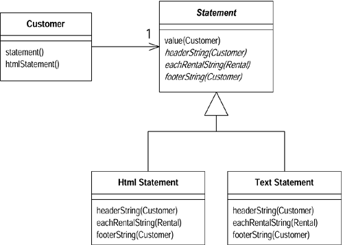
图11.2  Templae Method（模板函数）塑造完毕后的classes 

## 构造函数本体上移
---

你在各个subclass 中拥有一些构造函数，它们的本体（代码）几乎完全一致。

**在superclass 中新建一个构造函数，并在subclass 构造函数中调用它。**

```java
class Manager extends Employee...
    public Manager (String name, String id, int grade) {
        _name = name;
        _id = id;
        _grade = grade;
    }
```


```java
public Manager (String name, String id, int grade) {
    super (name, id);
    _grade = grade;
}
```


**动机（Motivation）**

构造函数（constructors ）是很奇妙的东西。它们不是普通函数，使用它们比使用普通函数受到更多的限制。

如果你看见各个subclass 中的函数有共同行为，你的第一个念头应该是将共同行为提炼到一个独立函数中，然后将这个函数提升到superclass 。对构造函数而言，它们彼此的共同行为往往就是「对象的建构」。这时候你需要在superclass 中提供一个构造函数，然后让subclass 都来调用它。很多时候，「调用superclass 构造函数」就是subclass 构造函数的惟一动作。这里不能运用[函数上移](dealing-with-generalization.md#_8)，因为你无法在subclass 中继承superclass 构造函数（你可曾痛恨过这个规定？）。

如果重构过程过于复杂，你可以考虑转而使用[以工厂函数取代构造函数](making-method-calls-simpler.md#_10)。


**作法（Mechanics）**

- 在superclass 中定义一个构造函数。
- 将subclass 构造函数中的共同代码搬移到superclass 构造函数中。
    - 被搬移的可能是subclass 构造函数的全部内容。
    - 首先设法将共同代码搬移到subclass 构造函数起始处，然后再拷贝到superclass构造函数中。
- 将subclass 构造函数中的共同代码删掉，改而调用新建的superclass 构造函数。
    - 如果subclass 构造函数中的所有代码都是共同码，那么对superclass 构造函数的调用将是subclass 构造函数的惟一动作。
- 编译，测试。
    - 如果日后subclass 构造函数再出现共同代码，你可以首先使用 [提炼函数](composing-methods.md#_1) 将那一部分提炼到一个独立函数，然后使用[函数上移](dealing-with-generalization.md#_8) 将该函数上移到superclass。
  


**范例：（Example）**

下面是一个表示「雇员」的Employee class 禾11 一个表示「经理」的Manager class：
```java
class Employee...
    protected String _name;
    protected String _id;

class Manager extends Employee...
    public Manager (String name, String id, int grade) {
        _name = name;
        _id = id;
        _grade = grade;
    }

    private int _grade;
```
   

Employee 的值域应该在Employee 构造函数中被设妥初值。因此我定义了一个Employee 构造函数，并将它声明为protected，表示subclass 应该调用它：
```java
class Employee
    protected Employee (String name, String id) {
        _name = name;
        _id = id;
    }
```


然后，我从中调用它：
```java
    public Manager (String name, String id, int grade) {
        super (name, id);
        _grade = grade;
    }
```   


后来情况又有些变化，构造函数中出现了共同代码。假如我有以下代码：
```java
class Employee...
    boolean isPriviliged() {..}
    void assignCar() {..}
class Manager...
    public Manager (String name, String id, int grade) {
        super (name, id);
        _grade = grade;
        if (isPriviliged()) assignCar(); //every subclass does this
    }
    boolean isPriviliged() {
        return _grade > 4;
    }
```   


我不能把调用assignCar() 的行为移到superclass 构造函数中，因为惟有把合适的值赋给_grade 值域后才能执行assignCar()。此时我需要[提炼函数](composing-methods.md#_1) 和 [函数上移](dealing-with-generalization.md#_8)。
```java
class Employee...
    void initialize() {
        if (isPriviliged()) assignCar();
    }
class Manager...
    public Manager (String name, String id, int grade) {
        super (name, id);
        _grade = grade;
        initialize();
    }
```


## 值域上移
---

两个subclasses 拥有相同的值域。

**将此一值域移至superclass。**

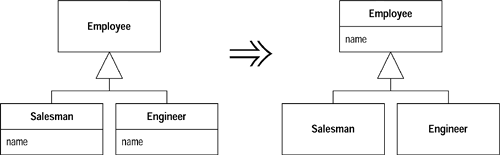


**动机（Motivation）**

如果各个subclass 是分别开发的，或者是在重构过程中组合起来的，你常会发现它们拥有重复特性，特别是值域更容易重复。这样的值域有时拥有近似的名字，但也并非绝对如此。判断若干值域是否重复，惟一的办法就是观察函数如何使用它们。如果它们被使用的方式很相似，你就可以将它们归纳到superclass 去。

本项重构从两方面减少重复：首先它去除了「重复的数据声明」；其次它使你可以将使用该值域的行为从subclass 移至superclass，从而去除「重复的行为」。


**作法（Mechanics）**

- 针对待提升之值域，检查它们的所有被使用点，确认它们以同样的方式被使用。
- 如果这些值域的名称不同，先将它们改名，使每一个名称都和你想为superclass 值域取的名称相同。
- 编译，测试。
- 在superclass 中新建一个值域。
    - 如果这些值域是private ，你必须将superclass 的值域声明为protected，这样subclasses 才能引用它。
- 移除subclass 中的值域。
- 编译，测试。
- 考虑对superclass 的新建值域使用[封装值域](organizing-data.md#_7)。

## 函数上移
---

有些函数，在各个subclass 中产生完全相同的结果。

**将该函数移至superclass。**

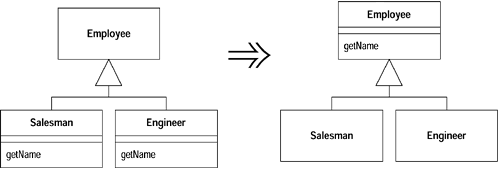


**动机（Motivation）**

避免「行为重复」是很重要的。尽管「重复的两个函数」也可以各自工作得很好， 但「重复」自身会成为错误的滋生地，此外别无价值。无论何时，只要系统之内出现重复，你就会面临「修改其中一个却未能修改另一个」的风险。通常，找出重复也有一定困难。

如果某个函数在各subclass 中的函数体都相同（它们很可能是通过「拷贝-粘贴」得到的），这就是最显而易见的[函数上移](dealing-with-generalization.md#_8) 适用场合。当然，情况并不总是如此明显。你也可以只管放心地重构，再看看测试程序会不会发牢骚，但这就需要对你的测试有充分的信心。我发现，观察这些可疑（可能重复的〕函数之间的差异往往大有收获：它们经常会向我展示那些我忘记测试的行为。

[函数上移](dealing-with-generalization.md#_8) 常常紧随其他重构而被使用。也许你能找出若干个「身处不 同subclasses 内的函数」而它们又可以「通过某种形式的参数调整」而后成为相同函数。这时候，最简单的办法就是首先分别调整这些函数的参数，然后再将它们概括（generalize）到superclass中。当然，如果你自信足够，也可以一次同时完成这两个步骤。

有一种特殊情况也需要使用[函数上移](dealing-with-generalization.md#_8) ： subclass 的函数覆写（overrides） 了superclass 的函数，但却仍然做相同的工作。

[函数上移](dealing-with-generalization.md#_8) 过程中最麻烦的一点就是：被提升的函数可能会引用「只出现于subclass 而不出现于superclass」的特性。如果被引用的是个函数，你可以将该函数也一同提升到superclass，或者在superclass 中建立一个抽象函数。在此过程中，你可能需要修改某个函数的签名式（signature），或建立一个委托函数（delegating method）。

如果两个函数相似但不相同，你或许可以先以[塑造模板函数](dealing-with-generalization.md#_5) 构造出相同的函数，然后再提升它们。


**作法（Mechanics）**

- 检查「待提升函数」，确定它们是完全一致的（identical）。
    - 如果这些函数看上去做了相同的事，但并不完全一致，可使用[替换你的算法](composing-methods.md#_10) 让它们变得完全一致。
- 如果「待提升函数」的签名式（signature）不同，将那些签名式都修改为你想要在superclass 中使用的签名式。
- 在superclass 中新建一个函数，将某一个「待提升函数」的代码拷贝到其中，做适当调整，然后编译。
    - 如果你使用的是一种强型（strongly typed）语言，而「待提升函数」 又调用了一个「只出现于subclass 未出现于superclass」的函数，你可以在superclass 中为被调用函数声明一个抽象函数。
    - 如果「待提升函数」使用了 subclass 的一个值域，你可以使用[值域上移](dealing-with-generalization.md#_7) 将该值域也提升到superclass；或者也可以先使用 [封装值域](organizing-data.md#_7)，然后在superclass 中把取值函数（getter）声明为抽象函数。
- 移除一个「待提升的subclass 函数」。
- 编译，测试。
- 逐一移除「待提升的如函数」，直到只剩下superclass 中的函数为止。每次移除之后都需要测试。
- 观察该函数的调用者，看看是否可以将它所索求的对象型别改为superclass。
  
  

**范例：（Example）**

我以Customer「表示「顾客」，它有两个subclass  ：表示「普通顾客」的RegularCustomer 和表示「贵宾」PreferredCustomer。


两个subclass 都有一个createBill() 函数，并且代码完全一样：
```java
void createBill (date Date) {
    double chargeAmount = charge (lastBillDate, date);
    addBill (date, charge);
}
```


但我不能直接把这个函数上移到superclass，因为各个subclass 的chargeFor() 函数并不相同。我必须先在superclass 中声明chargeFor()  抽象函数：
```java
class Customer...
    abstract double chargeFor(date start, date end)
```


然后，我就可以将createBill()  函数从其中一个subclass 拷贝到superclass。拷贝完之后应该编译，然后移除那个subclass 的createBill() 函数，然后编译并测试。 随后再移除另一个subclass 的createBill() 函数，再次编译并测试：
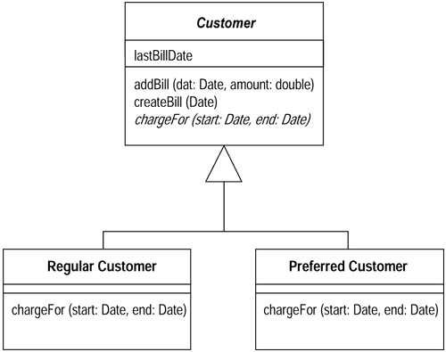
## 值域下移
---

superclass 中的某个值域只被部分（而非全部）subclasses 用到。

**将这个值域移到需要它的那些subclasses 去。**
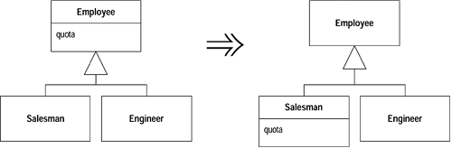


**动机（Motivation）**

[值域下移](dealing-with-generalization.md#_9) 恰恰相反 [值域上移](dealing-with-generalization.md#_7)。如果只有某些（而非全部）subclasses 需要superclass 内的一个值域，你可以使用本项重构。


**作法（Mechanics）**

  - 在所有subclass 中声明该值域。
  - 将该值域从superclass 中移餘。
  - 编译，测试。
  - 将该值域从所有不需要它的那些subclasses 中删掉。
  - 编译，测试。


## 函数下移
---

superclass 中的某个函数只与部分（而非全部）subclasses 有关。

**将这个函数移到相关的那些subclasses 去。**
  
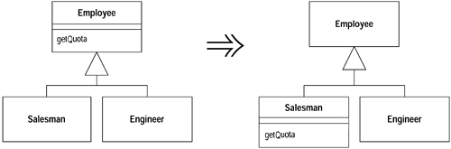


**动机（Motivation）**

[函数下移](dealing-with-generalization.md#_10) 恰恰相反于 [函数上移](dealing-with-generalization.md#_8)。当我有必要把某些行为从superclass 移至特定的subclass 时，我就使用[函数下移](dealing-with-generalization.md#_10)，它通常也只在这种时候有用。使用[提炼子类](dealing-with-generalization.md#_3) 之后你可能会需要它。


**作法（Mechanics）**

- 在所有subclass 中声明该函数，将superclass 中的函数本体拷贝到每一个subclass 函数中。
    - 你可能需要将superclass 的某些值域声明为protected，让subclass 函数也能够访问它们。如果日后你也想把这些值域下移到subclasses ， 通常就可以那么做；否则应该使用superclass 提供的访问函数（accessors）。如果访问函数并非public ，你得将它声明为protected 。
- 删除superclass 中的函数。
    - 你可能必须修改调用端的某些变量声明或参数声明，以便能够使用subclass 。
    - 如果有必要通过一个superclass 对象访问该函数，或如果你不想把该函数从任何subclass 中移除，或如果superclass 是抽象类，那么你就可以在superclass 中把该函数声明为抽象函数。
- 编译，测试。
- 将该函数从所有不需要它的那些subclasses 中删掉。
- 编译，测试。
  
  

**范例：（Example）**

我以Customer「表示「顾客」，它有两个subclass  ：表示「普通顾客」的RegularCustomer 和表示「贵宾」PreferredCustomer。


两个subclass 都有一个createBill() 函数，并且代码完全一样：
```java
void createBill (date Date) {
    double chargeAmount = charge (lastBillDate, date);
    addBill (date, charge);
}
``` 


但我不能直接把这个函数上移到superclass，因为各个subclass 的chargeFor() 函数并不相同。我必须先在superclass 中声明chargeFor()  抽象函数：
```java
class Customer...
    abstract double chargeFor(date start, date end)
```   
   

然后，我就可以将createBill()  函数从其中一个subclass 拷贝到superclass。拷贝完之后应该编译，然后移除那个subclass 的createBill() 函数，然后编译并测试。 随后再移除另一个subclass 的createBill() 函数，再次编译并测试：


## 以继承取代委托
---

你在两个classes 之间使用委托关系（delegation），并经常为整个接口编写许多极简单的请托函数（delegating methods）。

**让「请托（delegating）class」继承「受托 class （delegate）」。**

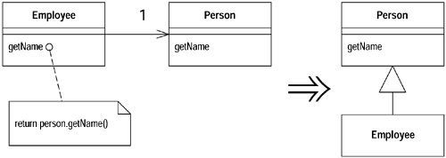


**动机（Motivation）**

本重构与[以继承取代委托](dealing-with-generalization.md#_11)恰恰相反。如果你发现自己需要使用「受托 class」中的所有函数，并且费了很大力气编写所有极简的请托函数（delegating methods），本重构可以帮助你轻松回头使用「继承」。

两条告诫需牢记于心。首先，如果你并没有使用「受托class 」的所有函数（而非只是部分函数），那么就不应该使用[以继承取代委托](dealing-with-generalization.md#_11)，因为subclass 应该总是遵循（奉行）superclass 的接口。如果过多的请托函数让你烦心，你有别的选择：你可以通过 [移除中间人](moving-features-between-objects.md#_6) 让客户端自己调用受托函数，也可以使用[提炼超类](dealing-with-generalization.md#_4) 将两个classes 接口相同的部分提炼到superclass 中， 然后让两个classes 都继承这个新的superclass ；你还可以以类似手法使用[提炼接口](dealing-with-generalization.md#_2)。

另一种需要当心的情况是：受托对象被不止一个其他对象共享，而且受托对象是可变的（mutable）。在这种情况下，你就不能将「委托关系」替换为「继承关系」，因为这样就无法再共享数据了。数据共享是必须由「委托关系」承担的一种责任，你无法把它转给「继承关系」。如果受托对象是不可变的（immutable），数据共享就不 成问题，因为你大可放心地拷贝对象，谁都不会知道。


**作法（Mechanics）**

- 让「请托端」成为「受托端」的一个subclass 。
- 编译。
    - 此时，某些函数可能会发生冲突：它们可能有相同的名称，但在返回型别（return type）、异常指定（exceptions）或可视性（visibility）方面有所差异。你可以使用[重新命名函数](making-method-calls-simpler.md#_9) 解决此类问题。
- 将「受托值域」（delegated field）设为「该值域所处之对象自身」。
- 去掉简单的请托函数（delegating methods）。
- 编译并测试。
- 将所有其他「涉及委托关系」的动作，改为「调用对象自身（继承而来的函 数）」。
- 移除「受托值域」（delegated field）。


**范例：（Example）**

下面是一个简单的Employee，将一些函数委托给另一个同样简单的Person ：
```java
class Employee {
    Person _person = new Person();

    public String getName() {
        return _person.getName();
    }
    public void setName(String arg) {
        _person.setName(arg);
    }
    public String toString () {
        return "Emp: " + _person.getLastName();
    }
}

class Person {
    String _name;

    public String getName() {
        return _name;
    }
    public void setName(String arg) {
        _name = arg;
    }
    public String getLastName() {
        return _name.substring(_name.lastIndexOf(' ')+1);
    }
}
```   


第一步，只需声明两者之间的继承关系：

```java
class Employee extends Person
```   
    

此时，如果有任何函数发生冲突，编译器会提醒我。如果某几个函数的名称相同、但返回型别不同，或抛出不同的异常，它们之间就会出现冲突。所有此类问题都可以通过[重新命名函数](making-method-calls-simpler.md#_9) 加以解决。为求简化，我没有在范例中列出这些麻烦情况。

下一步要将「受托值域」（delegated field）设值为「该值域所处之对象自身」。同时，我必须先删掉所有简单的请托函数（例如getName() 和setName()）。如果留下这种函数，就会因为无限递归而引起系统的call stack 满溢（overflow）。在此范例中，我应该把Employee 的getName() 和setName() 拿掉。

一旦Employee 可以正常工作了，我就修改其中「使用了请托函数（译注：或受托值域）」的函数，让它们直接调用「从superclass  继承而来的函数」：

```java
public String toString () {
    return "Emp: " + getLastName();
}
```     
      

摆脱所有涉及委托关系的函数后，我也就可以摆脱_person 这个（受托）值域了。 

## 以委托取代继承
---

某个subclass 只使用superclass 接口中的一部分，或是根本不需要继承而来的数据。

**在subclass 中新建一个值域用以保存superclass ；调整subclass 函数，令它改而委托superclass ；然后去掉两者之间的继承关系。**


**动机（Motivation）**

继承（Inheritance ）是一件很棒的事，但有时候它并不是你要的。常常你会遇到这样的情况：一开始你继承了一个class ，随后发现superclass 的许多操作并不真正 适用于subclass 。这种情况下你所拥有的接口并未真正反映出class 的功能。或者，你可能发现你从superclass 中继承了 一大堆subclass 并不需要的数据，抑或者你可能发现superclass 中的某些protected 函数对subclass 并没有什么意义。

你可以选择容忍，并接受传统说法：subclass 可以只使用superclass 功能的一部分。但这样做的结果是：代码传达的信息与你的意图南辑北辙——这是一种裩淆，你应该将它去除。

如果以委托（delegation）取代继承（Inheritance ），你可以更清楚地表明：你只需要受托类（delegated class）的一部分功能。接口中的哪一部分应该被使用，哪一部分应该被忽略，完全由你主导控制。这样做的成本则是需要额外写出请托函数（delegating methods），但这些函数都非常简单，极少可能出错。


**作法（Mechanics）**

- 在subclass 中新建一个值域，使其引用（指向、指涉、refers）superclass 的一个实体，并将它初始化为this。
- 修改subclass 内的每一个（可能）函数，让它们不再使用superclass ，转而使 用上述那个「受托值域」（delegated field）。每次修改后，编译并测试。
    - 你不能如此这般地修改subclass 中「通过super 调用superclass 函数」的函数，否则它们会陷入无限递归（infinite recurse）。这一类函数只有在继承关系被打破后才能修改。
- 去除两个classes 之间的继承关系，将上述「受托值域」（delegated field）的赋值动作修改为「赋予一个新对象」。
- 针对客户端所用的每一个superclass 函数，为它添加一个简单的请托函数（delegating method）。
- 编译，测试。


**范例：（Example）**

「滥用继承」的一个经典范例就是让Stack class 继承Vector class 。Java 1.1的utility library（java.util）恰好就是这样做的。（这些淘气的孩子啊！）不过，作为范例，我只给出一个比较简单的形式：
```java
class MyStack extends Vector {

    public void push(Object element) {
        insertElementAt(element,0);
    }

    public Object pop() {
        Object result = firstElement();
        removeElementAt(0);
        return result;
    }
}
```   
    

只要看看Mystack 用户，我就会发现，用户只要它做四件事：push()、pop()、size() 和 isEmpty()。后两个函数是从Vector 继承来的。

我要把这里的继承关系改为委托关系。首先，我要在中新建一个值域，用以保存「受托之Vector 对象」。一开始我把这个值域初始化为this，这样在重构进行过程中，我就可以同时使用继承和委托：

```java
private Vector _vector = this;
```     
      

现在，我开始修改MyStack 的函数，让它们使用委托关系。首先从push() 开始：

```java
public void push(Object element) {
    _vector.insertElementAt(element,0);
}
```     
    

此时我可以编译并测试，一切都将运转如常。现在轮到pop() ：

```java
public Object pop() {
    Object result = _vector.firstElement();
    _vector.removeElementAt(0);
    return result;
}
```     
      

修改完所有subclass 函数后，我可以打破与superclass 之间的联系了 ：

```java
class MyStack extends Vector
    private Vector _vector = new Vector();
```     
      

然后，对于Stack 客户端可能用到的每一个Vector 函数（译注：这些函数原本是 继承而来的），我都必须在中添加一个简单的请托函数（delegating method）：

```java
public int size() {
    return _vector.size();
}
public boolean isEmpty() {
    return _vector.isEmpty();
}
```     
      

现在我可以编译并测试。如果我忘记加入某个请托函数，编译器会告诉我。
