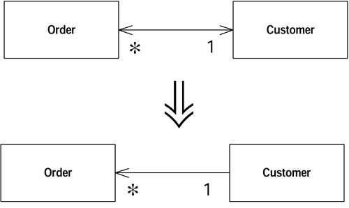
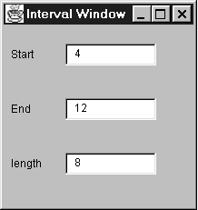

## 将双向关联改为单向
---

两个鄉之间有双向关联，但其中一个class如今不再需要另一个class的特性。

去除不必要的关联（association）。



**动机（Motivation）**

双向关联（bidirectional associations）很有用，但你也必须为它付出代价，那就是「维护双向连接、确保对象被正确创建和删除」而增加的复杂度。而且，由于很多程序 员并不习惯使用双向关联，它往往成为错误之源。

大量的双向连接（two-way links）也很容易引发「僵尸对象」：某个对象本来已经该死亡了，却仍然保留在系统中，因为对它的各项引用还没有完全清除。

此外，双向关联也迫使两个classes之间有了相依性。对其中任一个class的任何修 改，都可能引发另一个class的变化。如果这两个classes处在不同的package中， 这种相依性就是packages之间的相依。过多的依存性（inter-dependencies）会造就紧耦合（highly coupled）系统，使得任何一点小小改动都可能造成许多无法预知的后果。

只有在你需要双向关联的时候，才应该使用它。如果你发现双向关联不再有存在价值，就应该去掉其中不必要的一条关联。

**作法（Mechanics）**

- 找出『你想去除的指针」的保存值域，检查它的每一个用户，判断是否可以去除该指针。
  - 不但要检查「直接读取点」，也要检查「直接读取点」的调用函数。
  - 考虑有无可能不通过指针取得「被引用对象」（referred object）。如 果有可能，你就可以对取值函数（getter）使用[替换你的算法](composing-methods.md#_10)，从而让客户在没有指针的情况下也可以使用该取值函数。
  - 对于使用该值域的所有函数，考虑将「被引用对象」（refered object）作为引数（argument）传进去。
- 如果客户使用了取值函数（getter），先运用[封装值域](organizing-data.md#_7) 将「待除值域」自我封装起来，然后使用[替换你的算法](composing-methods.md#_10) 对付取值函数，令它不再使用该（待除）值域。然后编译、测试。
- 如果客户并未使用取值函数（getter），那就直接修改「待除值域」的所有被引用点：改以其他途径获得该值域所保存的对象。每次修改后，编译并测试。
- 如果已经没有任何函数使用该（待除〕值域，移除所有「对该值域的更新逻辑」，然后移除该值域。
  - 如果有许多地方对此值域赋值，先运用[封装值域](organizing-data.md#_7) 使这些地点改用同一个设值函数（setter）。编译、测试。而后将这个 设值函数的本体清空。再编译、再测试。如果这些都可行，就可以将此值域和其设值函数，连同对设值函数的所有调用，全部移除。
- 编译，测试。


**范例（Example）**

本例从 [将单向关联改为双向](organizing-data.md#_3) 留下的代码开始进行，其中Customer和Order之间有双向关联：
```java
class Order...
    Customer getCustomer() {
        return _customer;
    }
    void setCustomer (Customer arg) {
        if (_customer != null) _customer.friendOrders().remove(this);
        _customer = arg;
        if (_customer != null) _customer.friendOrders().add(this);
    }
    private Customer _customer;  //译注：这是Order-to-Customer link也是本例的移除对象

class Customer...
    void addOrder(Order arg) {
        arg.setCustomer(this);
    }
    private Set _orders = new HashSet();
    //译注：以上是Customer-to-Order link
    Set friendOrders() {
        /** should only be used by Order */
        return _orders;
    }
```


后来我发现，除非先有Customer对象，否则不会存在Order对象。因此我想将「从Order 到Customer的连接」移除掉。

对于本项重构来说，最困难的就是检查可行性。如果我知道本项重构是安全的，那么重构手法自身十分简单。问题在于是否有任何代码倚赖_customer 值域的存在。 如果确实有，那么在删除这个值域之后，我必须提供替代品。

首先，我需要研究所有读取这个值域的函数，以及所有使用这些函数的函数。我能找到另一条途径来供应Customer对象吗——这通常意味将Customer对象作为引数（argument）传递给其用户〔某函数〕。下面是一个简化例子：
```java
class Order...
    double getDiscountedPrice() {
    return getGrossPrice() * (1 - _customer.getDiscount());
}
```


改变为：
```java
class Order...
    double getDiscountedPrice(Customer customer) {
    return getGrossPrice() * (1 - customer.getDiscount());
}
```


如果待改函数是被Customer对象调用的，那么这样的修改方案特别容易实施，因为Customer对象将自己作为引数（argument）传给函数很是容易。所以下列代码：
```java
class Customer...
double getPriceFor(Order order) {
    Assert.isTrue(_orders.contains(order)); // see [引入断言](simplifying-conditional-expressions.md#_4) (267)
    return order.getDiscountedPrice();
```


变成了：
```java
class Customer...
    double getPriceFor(Order order) {
        Assert.isTrue(_orders.contains(order));
        return order.getDiscountedPrice(this);
    }
```


另一种作法就是修改取值函数（getter），使其在不使用_customer 值域的前提下返回一个Customer对象。如果这行得通，我就可以使用[替换你的算法](composing-methods.md#_10) 修改Order.getCustomer()函数算法。我有可能这样修改代码：
```java
Customer getCustomer() {
    Iterator iter = Customer.getInstances().iterator();
    while (iter.hasNext()) {
        Customer each = (Customer)iter.next();
        if (each.containsOrder(this)) return each;
    }
    return null;
}
```


这段代码比较慢，不过确实可行。而且，在数据库环境下，如果我需要使用数据库查询语句，这段代码对系统性能的影响可能并不显著。如果Order class中有些函 数使用_customer值域，我可以实施[封装值域](organizing-data.md#_7) 令它们转而改 用上述的getCustomer() 函数。

如果我要保留上述的取值函数（getter），那么Order和Customer的关联从接口上看虽然仍是双向，但实现上已经是单向关系了。虽然我移除了反向指针，但两个classes彼此之间的依存关系（inter-dependencies）仍然存在。

如果我要替换取值函数（getter），那么我就专注地替换它，其他部分留待以后处理。 我会逐一修改取值函数的调用者，让它们通过其他来源取得Customer对象。每次修改后都编译并测试。实际工作中这一过程往往相当快。如果这个过程让我觉得很棘手很复杂，我会放弃本项重构。

一旦我消除了_customer值域的所有读取点，我就可以着手处理「对此值域进行赋值动作」的函数了（译注：亦即设值函数，setter)。很简单，只要把这些赋值动作 全部移除，再把值域一并删除，就行了。由于已经没有任何代码需要这个值域，所以删掉它并不会带来任何影响。


## 将引用对象改为实值对象
---

你有一个reference object（引用对象），很小且不可变（immutable），而且不易管理。


将它变成一个value object（实值对象）。


**动机（Motivation）**

正如我在[将引用对象改为实值对象](organizing-data.md#_2)中所说，要在reference object和value object之间做选择，有时并不容易。作出选择后，你常会需要一条回头路。

如果reference object开始变得难以使用，也许你就应该将它改为value object。 reference object必须被某种方式控制，你总是必须向其控制者请求适当的reference object。它们可能造成内存区域之间错综复杂的关联。在分布系统和并发系统中，不可变的value object特别有用，因为你无须考虑它们的同步问题。

value object有一个非常重要的特性：它们应该是不可变的（immutable）。无论何时只要你调用同一对象的同一个查询函数，你都应该得到同样结果。如果保证了这一 点，就可以放心地以多个对象表示相同事物（same thing）。如果value object是可变的（mutable），你就必须确保你对某一对象的修改会自动更新其他「代表相同事物」的其他对象。这太痛苦了，与其如此还不如把它变成reference object。

这里有必要澄清一下「不可变（immutable）」的意思。如果你以Money class表示「钱」的概念，其中有「币种」和「金额」两条信息，那么Money对象通常是一个不可变的value object。这并非意味你的薪资不能改变，而是意味：如果要改变你的薪资，你需要使用另一个崭新的Money对象来取代现有的Money对象，而不是在现有的Money对象上修改。你和Money对象之间的关系可以改变，但Money对象自身不能 改变。

译注：《Practical Java》 by Peter Haggar第6章对于mutable/immutable有深入讨论。
**作法（Mechanics）**

- 检查重构对象是否为immutable（不可变）对象，或是否可修改为不可变对象。
  - 如果该对象目前还不是immutable，就使用[移除设置函数](making-method-calls-simpler.md#_8)，直到它成为immutable为止。
  - 如果无法将该对象修改为immutable，就放弃使用本项重构。
- 建立equal()和hashCode()。
- 编译，测试。
- 考虑是否可以删除factory method，并将构造函数声明public 。


**范例（Example）**

让我们从一个表示「货币种类」的Currency class开始：
```java
class Currency...
    private String _code;

    public String getCode() {
       return _code;
    }
    private Currency (String code) {
       _code = code;
    }
```


这个也所做的就是保存并返回一个货币种类代码。它是一个reference object，所以如果要得到它的一份实体，必须这么做：
```java
Currency usd = Currency.get("USD");
```


Currency class维护一个实体链表（list of instances）；我不能直接使用构造函数创建实体，因为Currency构造函数是private。

```java
new Currency("USD").equals(new Currency("USD")) // returns false
```


要把一个reference object变成value object，关键动作是：检查它是否为immutable（不可变）。如果不是，我就不能使用本项重构，因为mutable（可变的）value object会造成令人苦恼的别名现象（aliasing）。


在这里，Currency对象是不可变的，所以下一步就是为它定义equals()：
```java
public boolean equals(Object arg) {
    if (! (arg instanceof Currency)) return false;
    Currency other = (Currency) arg;
    return (_code.equals(other._code));
}
```


如果我定义equals()，我必须同时定义hashCode()。实现hashCode()有个简单办法：读取equals()使用的所有值域的hash codes；然后对它们进行bitwise xor（^）操作。本例中这很容易实现，因为equals()只使用了一个值域：
```java
public int hashCode() {
    return _code.hashCode();
}
```


完成这两个函数后，我可以编译并测试。这两个函数的修改必须同时进行，否则倚赖hashing的任何群集对象（collections，例如HashTable、HashSet和HashMap）可能会产生意外行为。


现在，我想创建多少个等值的Currency对象就创建多少个。我还可以把构造函数声明为public，直接以构造函数获取Currency实体，从而去掉Currency class中的factory method和「控制实体创建」的行为。
```java
new Currency("USD").equals(new Currency("USD")) // now returns true
```


## 将单向关联改为双向
---


两个classes都需要使用对方特性，但其间只有一条单向连接（one-way link）。

添加一个反向指针，并使修改函数（modifiers）能够同时更新两条连接。（译注：这里的指针等同于句柄（handle），修改函数（modifier）指的是改变双方关系者）

 
**动机（Motivation）**

开发初期，你可能会在两个classes之间建立一条单向连接，使其中一个可以引用另一个class。随着时间推移，你可能发现referred class 需要得到其引用者（某个object）以便进行某些处理。也就是说它需要一个反向指针。但指针乃是一种单向连接，你不可能反向操作它。通常你可以绕道而行，虽然会耗费一些计算时间， 成本还算合理，然后你可以在referred class中建立一个专职函数，负责此一行为。 但是，有时候，想绕过这个问题并不容易，此时你就需要建立双向引用关系（two-way reference），或称为反向指针（back pointer）。如果你不习惯使用反向指针，它们很容易造成混乱；但只要你习惯了这种手法，它们其实并不是太复杂。

「反向指针」手法有点棘手，所以在你能够自在运用它之前，应该有相应的测试。通常我不花心思去测试访问函数（accessors），因为普通访问函数的风险没有高到需要测试的地步，但本重构要求测试访问函数，所以它是极少数需要添加测试的重构 手法之一。

本重构运用反向指针（back pointer）实现双向关联（bidirectionality）。其他技术（例如连接对象，link object）需要其他重构手法。
 
**作法（Mechanics）**

- 在class中增加一个值域，用以保存「反向指针」。
- 决定由哪个class (引用端或被引用端）控制关联性（association）。
- 在「被控端」建立一个辅助函数，其命名应该清楚指出它的有限用途。
- 如果既有的修改函数（modifier）在「控制端」，让它负责更新反向指针。
- 如果既有的修改函数（modifier）在「被控端」，就在「控制端」建立一个控制函数，并让既有的修改函数调用这个新建的控制函数。


**范例（Example）**

下面是一段简单程序，其中有两个classes：表示「定单」的Order 和表示「客户」的Customer。Order引用了Customer，Customer则并没有引用Order：
```java
class Order...
Customer getCustomer() {
    return _customer;
}
void setCustomer (Customer arg) {
    _customer = arg;
}
Customer _customer;
```


首先，我要为Customer添加一个值域。由于一个客户可以拥有多份定单，所以这个新增值域应该是个群集（collection）。我不希望同一份定单在同一个群集中出现一次以上，所以这里适合使用set：
```java
class Customer  {
    private Set _orders = new HashSet();
```


现在，我需要决定由哪一个class负责控制关联性（association）。我比较喜欢让单一class来操控，因为这样我就可以将所有「关联处理逻辑」集中安置于一地。我将按照下列步骤做出这一决定：

- 如果两者都是reference objects，而其间的关联是「一对多」关系，那么就由「拥有单一 reference 」的那一方承担「控制者」角色。以本例而言，如果一个客户可拥有多份定单，那么就由Order class （定单）来控制关联性。
- 如果某个对象是另一对象的组成（component），那么由后者负责控制关联性。
- 如果两者都是reference objects，而其间的关联是「多对多」关系，那么随便其中哪个对象来控制关联性，都无所谓。


本例之中由于Order负责控制关联性，所以我必须为Customer添加一个辅助函数，让Order可以直接访问 _orders（订单〕群集。Order的修改函数（modifier）将使用这个辅助函数对指针两端对象进行同步控制。我将这个辅助函数命名为friendOrders() ，表示这个函数只能在这种特殊情况下使用。此外，如果Order和Customer位在同一个package内，我还会将friendOrders ()声明为「package可见度」（译注：亦即不加任何修饰符的缺省访问级别），使其可见程度降到最低。

但如果这两个classes不在同一个package内，我就只好把friendOrders() 声明为public 了。
```java
class Customer...
    Set friendOrders() {
        /** should only be used by Order when modifying the association */
        return _orders;
    }
```


现在，我要改变修改函数（modifier），令它同时更新反向指针：
```java
class Order...
    void setCustomer (Customer arg) ...
        if (_customer != null) _customer.friendOrders().remove(this);
        _customer = arg;
         if (_customer != null) _customer.friendOrders().add(this); 
```


classes 之间的关联性是各式各样的，因此修改函数（modifier ）的代码也会随之有所差异。如果_customer 的值不可能是null ，我可以拿掉上述的第一个null 检查， 但仍然需要检查引数（argument）是否为null 。不过，基本形式总是相同的：先让对方删除「指向你」的指针，再将你的指针指向一个新对象，最后让那个新对象把 它的指针指向你。

如果你希望在Customer 中也能修改连接（link），就让它调用控制函数：
```java
class Customer...
    void addOrder(Order arg) {
        arg.setCustomer(this);
    }
```


如果一份定单也可以对应多个客户，那么你所面临的就是一个「多对多」情况，重构后的函数可能是下面这样：
```java
class Order... //controlling methods
    void addCustomer (Customer arg) {
        arg.friendOrders().add(this);
        _customers.add(arg);
    }
    void removeCustomer (Customer arg) {
        arg.friendOrders().remove(this);
        _customers.remove(arg);
    }

class Customer...
    void addOrder(Order arg) {
        arg.addCustomer(this);
    }
    void removeOrder(Order arg) {
        arg.removeCustomer(this);
    }
```

## 将实值对象改为引用对象
---

你有一个class，衍生出许多相等实体（equal instances），你希望将它们替换为单一对象。

将这个value object （实值对象）变成一个reference object (引用对象）。

和hashCode()）。

要在reference object和value objects之间做选择有时并不容易。有时候，你会从一个简单的value objects开始，在其中保存少量不可修改的数据。而后，你可能会希望给这个对象加入一些可修改数据，并确保对任何一个对象的修改都能影响到所有引用此一对象的地方。这时候你就需要将这个对象变成一个reference object。

**作法（Mechanics）**

- 使用[以工厂函数取代构造函数](making-method-calls-simpler.md#_10)。
- 编译，测试。
- 决定由什么对象负责提供访问新对象的途径。
  - 可能是个静态字典（static dictionary）或一个注册对象（registry object）。
  - 你也可以使用多个对象作为新对象的访问点（access point）。
  - 决定这些reference object应该预先创建好，或是应该动态创建。
    - 如果这些reference object是预先创建好的,而你必须从内存中将它们读取出来，那么就得确保它们在被需要的时候能够被及时加载。
    - 修改factory method 5 ，令它返回reference object。
    - 如果对象是预先创建好的，你就需要考虑：万一有人索求一个其实并不存在的对象，要如何处理错误？
    - 你可能希望对factory method使用[重新命名函数](making-method-calls-simpler.md#_9)，使其传达这样的信息：它返回的是一个既存对象。
- 编译，测试。

5译注：此处之factory method不等同于GoF在《Design Patterns》书中提出的Factory Method。为避免混淆，读者应该将此处的factory method理解为"Creational Method"，亦即「用以创建某种实体」的函数，这个概念包含GoF的Factory Method，而又比Factory Method广泛。

**范例（Example）**

在[以对象取代数据值](organizing-data.md#_9) 一节中，我留下了一个重构后的程序，本节范例就从它开始。我们有下列的Customer class：
```java
class Customer {
    public Customer (String name) {
        _name = name;
    }
    public String getName() {
        return _name;
    }
    private final String _name;
}
```


它被以下的Ordre class使用：
```java
class Order...
    public Order (String customerName) {
        _customer = new Customer(customerName);
    }
    public void setCustomer(String customerName) {
        _customer = new Customer(customerName);
    }
    public String getCustomerName() {
        return _customer.getName();
    }
    private Customer _customer;
```


此外，还有一些代码也会使用Customer对象：
```java
private static int numberOfOrdersFor(Collection orders, String customer) {
    int result = 0;
    Iterator iter = orders.iterator();
    while (iter.hasNext()) {
        Order each = (Order) iter.next();
        if (each.getCustomerName().equals(customer)) result++;
    }
    return result;
}
```


到目前为止，Customer对象还是value object。就算多份定单属于同一客户，但每个Order对象还是拥有各自的Customer对象。我希望改变这一现状，使得一旦同 一客户拥有多份不同定单，代表这些定单的所有Order对象就可以共享同一个Customer对象。本例中这就意味：每一个客户名称只该对应一个Customer对象。


首先我使用 [以工厂函数取代构造函数](making-method-calls-simpler.md#_10)。这样，我就可以控制Customer对象的创建过程，这在以后会是非常重要的。我在Customer class中定义这个factory method：
```java
class Customer {
    public static Customer create (String name) {
        return new Customer(name);
}
```


然后我把「对构造函数的调用」替换成「对factory method的调用」：
```java
class Order {
    public Order (String customer) {
        _customer = Customer.create(customer);
    }
```


然后我再把构造函数声明为private：
```java
class Customer {
    private Customer (String name) {
        _name = name;
    }
```


现在，我必须决定如何访问Customer对象。我比较喜欢通过另一个对象（例如Order class中的一个值域）来访问它。但是本例并没有这样一个明显的值域可用于访问Customer对象。在这种情况下，我通过会创建一个注册（登录）对象，作为访问点。为了简化我们的例子，我把Customer对象保存在Customer class的一个static值域中，让Customer class作为访问点：
```java
private static Dictionary _instances = new Hashtable();
```

然后我得决定：应该在接到请求时创建新的Customer对象，还是应该预先将它们创建好。这里我选择后者。在应用程序的启动代码（start-up code）中，我先把需要使用的Customer对象加载妥当。这些对象可能来自数据库，也可能来自文件。为求简单起见，我在代码中明确生成这些对象。反正以后我总是可以使用 [替换你的算法](composing-methods.md#_10) 来改变它们的创建方式。
```java
class Customer...
    static void loadCustomers() {
        new Customer ("Lemon Car Hire").store();
        new Customer ("Associated Coffee Machines").store();
        new Customer ("Bilston Gasworks").store();
    }
    private void store() {
        _instances.put(this.getName(), this);
    }
```


现在，我要修改factory method，让它返回预先创建好的Customer对象：
```java
public static Customer create (String name) {
    return (Customer) _instances.get(name);
}
```
 

由于create()总是返回既有的Customer对象，所以我应该使用[重新命名函数](making-method-calls-simpler.md#_9) 修改这个factory method的名称，以便强调（说明）这一点。
```java
class Customer...
    public static Customer getNamed (String name) {
        return (Customer) _instances.get(name);
    }
```

## 复制被监视数据
---


(译注：本节大量保留domain，presentation，event，getter/setter，observed等字眼。所谓presentation class，用以处理「数据表现形式」；所谓domain class，用以处理业务逻辑。）
 
你有一些domain class置身于GUI控件中，而domain method需要访问之。
 
将该笔数据拷贝到一个domain object中。建立一个Observer模式，用以对domain object和GUI object内的重复数据进行同步控制（sync.）。


**动机（Motivation）**

一个分层良好的系统，应该将处理用户界面（UI）和处理业务逻辑（business logic）的代码分开。之所以这样做，原因有以下几点：(1) 你可能需要使用数个不同的用 户界面来表现相同的业务逻辑；如果同时承担两种责任，用户界面会变得过分复杂； (2) 与GUI隔离之后，domain class的维护和演化都会更容易；你甚至可以让不同的开发者负责不同部分的开发。

尽管你可以轻松地将「行为」划分到不同部位，「数据」却往往不能如此。同一笔 数据有可能既需要内嵌于GUI控件，也需要保存于domain model里头。自从MVC（Model-View-Controller）模式出现后，用户界面框架都使用多层系统（multitiered system）来提供某种机制，使你不但可以提供这类数据，并保持它们同步（sync.）。

如果你遇到的代码是以双层（two-tiered）方式开发，业务逻辑（business logic）被内嵌于用户界面（UI）之中，你就有必要将行为分离出来。其中的主要工作就是函数的分解和搬移。但数据就不同了：你不能仅仅只是移动数据，你必须将它复制到新建部位中，并提供相应的同步机制。

**作法（Mechanics）（译注：建议搭配范例阅读）**

- 修改presentation class，使其成为 domain class 的 Observer[GoF]。
    - 如果尚未有domain class，就建立一个。
    - 如果没有「从presentation class到domain class的关联性（link）， 就将domain class保存于咖presentation class的一个值域中。
- 针对GUI class内的domain data，使用[封装值域](organizing-data.md#_7)。
- 编译，测试。
- 在事件处理函数（event handler）中加上对设值函数（setter）的调用，以「直接访问方式」（译注：亦即直接调用组件提供的相关函数）更新GUI组件。
    - 在事件处理函数中放一个设值函数（setter），利用它将GUI组件更新为domain data的当前值。当然这其实没有必要，你只不过是拿它的值设定它自己。但是这样使用setter，便是允许其中的任何动作得以于日后被执行起来，这是这一步骤的意义所在。
    - 进行这个改变时，对于组件，不要使用取值函数（getter），应该采取「直接取用」方式（译注：亦即直接调用GUI组件所提供的函数），因为稍后我们将修改取值函数（getter），使其从domain object（而非GUI组件）取值。设值函数（setter）也将遭受类似修改。
    - 确保测试代码能够触发新添加的事件处理（event handler）机制。
- 编译，测试。
- 在domain class中定义数据及其相关访问函数（accessors）。
    - 确保domain class中的设值函数（setter）能够触发Observer模式的通报机制（notify mechanism）。
    - 对于被观察（被监视）的数据，在domain class中使用「与presentation class所用的相同型别」（通常是字符串）来保存。后续重构中你可以自由改变这个数据型别。
    - 修改presentation class中的访问函数（accessors），将它们的操作对象改为 domain object （而非GUI组件）。
    - 修改observer（译注：亦即presentation class）的update()，使其从相应的domain object中将所需数据拷贝给GUI组件。
- 编译，测试。


**范例（Example）**

我们的范例从图8.1所示窗口开始。其行为非常简单：当用户修改文本框中的数值，另两个文本框就会自动更新。如果你修改Start或End，length就会自动成为两者计算所得的长度；如果你修改length，End就会随之改变。

图8.1  一个简单的GUI窗口


一开始，所有函数都放在IntervalWindow class中。所有文本都能够响应「失去键盘焦点」（loss of focus）这一事件。
```java
public class IntervalWindow extends Frame...
    java.awt.TextField _startField;
    java.awt.TextField _endField;
    java.awt.TextField _lengthField;

    class SymFocus extends java.awt.event.FocusAdapter {
        public void focusLost(java.awt.event.FocusEvent event) {
            Object object = event.getSource();
            //译注：侦测到哪一个文本框失去键盘焦点，就调用其event-handler.
            if (object == _startField)
                StartField_FocusLost(event);
            else if (object == _endField)
                EndField_FocusLost(event);
            else if (object == _lengthField)
                LengthField_FocusLost(event);
        }
    }
```


当Start文本框失去焦点，事件监听器调用StartField_FocusLost ()。另两个文本框的处理也类似。事件处理函数大致如下：
```java
void StartField_FocusLost(java.awt.event.FocusEvent event) {
    if (isNotInteger(_startField.getText()))
        _startField.setText("0");
        calculateLength();
    }

    void EndField_FocusLost(java.awt.event.FocusEvent event) {
        if (isNotInteger(_endField.getText()))
            _endField.setText("0");
        calculateLength();
    }

    void LengthField_FocusLost(java.awt.event.FocusEvent event) {
        if (isNotInteger(_lengthField.getText()))
            _lengthField.setText("0");
        calculateEnd();
    }
```


你也许会奇怪，为什么我这样实现一个窗口呢？因为在我的IDE集成开发环境（Cafe）中，这是最简单的方式。

如果文本框内的字符串无法转换为一个整数，那么该文本框的内容将变成0。而后，调用相关计算函数：
```java
void calculateLength(){
    try {
        int start = Integer.parseInt(_startField.getText());
        int end = Integer.parseInt(_endField.getText());
        int length = end - start;
        _lengthField.setText(String.valueOf(length));
    } catch (NumberFormatException e) {
        throw new RuntimeException ("Unexpected Number Format Error");
    }
}
void calculateEnd() {
    try {
        int start = Integer.parseInt(_startField.getText());
        int length = Integer.parseInt(_lengthField.getText());
        int end = start + length;
        _endField.setText(String.valueOf(end));
    } catch (NumberFormatException e) {
        throw new RuntimeException ("Unexpected Number Format Error");
    }
}
```


我的任务就是将非视觉性的计算逻辑从GUI中分离出来。基本上这就意味将calculateLength ()和calculateEnd ()移到一个独立的domain class去。为了这一目的，我需要能够在不引用（指涉，referring）窗口类的前提下取用Start、End和 length 三个文本框的值。惟一办法就是将这些数据复制到domain class中，并保持与GUI class数据同步。这就是[复制被监视数据](organizing-data.md#_5) 的任务。

截至目前我还没有一个domain class，所以我着手建立一个：
```java
class Interval extends Observable {}
```

IntervalWindow class需要与此崭新的domain class建立一个关联：
```java
private Interval _subject;
```


然后，我需要合理地初始化_subject值域，并把IntervalWindow class变成Interval class的一个Observer。这很简单,只需把下列代码放进IntervalWindow构造函数中就可以了 ：
```java
_subject = new Interval();
_subject.addObserver(this);
update(_subject, null);
```

我喜欢把这段代码放在整个建构过程的最后。其中对update()的调用可以确保： 当我把数据复制到domain class后，GUI将根据domain class进行初始化。update()是在java.util.observer接口中声明的，因此我必须让IntervalWindow class实现这一接口：
```java
public class IntervalWindow extends Frame implements Observer
```

然后我还需要为IntervalWindow class建立一个update()。此刻我先令它为空：
```java
public void update(Observable observed, Object arg) { }
```

现在我可以编译并测试了。到目前为止我还没有做出任何真正的修改。呵呵，小心驶得万年船。

接下来我把注意力转移到文本框。一如往常我每次只改动一点点。为了卖弄一下我的英语能力，我从End文本框开始。第一件要做的事就是实施 [封装值域](organizing-data.md#_7)。文本框的更新是通过getText()和setText()两函数实现的，因此我所建立的访问函数（accessors）需要调用这两个函数：
```java
//译注：class IntervalWindow...
String getEnd() {
    return _endField.getText();
}

void setEnd (String arg) {
    _endField.setText(arg);
}
```

然后，找出_endField 的所有引用点，将它们替换为适当的访问函数：
```java
void calculateLength(){
    try {
        int start = Integer.parseInt(_startField.getText());
        int end = Integer.parseInt(getEnd());
        int length = end - start;
        _lengthField.setText(String.valueOf(length));
    } catch (NumberFormatException e) {
        throw new RuntimeException ("Unexpected Number Format Error");
    }
}

void calculateEnd() {
    try {
        int start = Integer.parseInt(_startField.getText());
        int length = Integer.parseInt(_lengthField.getText());
        int end = start + length;
        setEnd(String.valueOf(end));
    } catch (NumberFormatException e) {
        throw new RuntimeException ("Unexpected Number Format Error");
    }
}

void EndField_FocusLost(java.awt.event.FocusEvent event) {
    if (isNotInteger(getEnd()))
        setEnd("0");
    calculateLength();
}
```

这是[封装值域](organizing-data.md#_7) 的标准过程。然而当你处理GUI class 时，情况还更复杂些：用户可以直接（通过GUI ）修改文本框内容，不必调用setEnd()。 因此我需要在GUI class 的事件处理函数中加上对setEnd() 的调用。这个动作把文本框设定为其当前值。当然，这没带来什么影响，但是通过这样的方式，我 们可以确保用户的输入的确是通过设值函数（setter）进行的：
```java
void EndField_FocusLost(java.awt.event.FocusEvent event) {
    setEnd(_endField.getText());        //译注：注意对以下对此行的讨论
    if (isNotInteger(getEnd()))
        setEnd("0");
    calculateLength();
}
```


上述调用动作中，我并没有使用上一页的getEnd() 取得End 文本框当前内容，而是直接取用该文本框。之所以这样做是因为，随后的重构将使上一页的getEnd() 从domain object（而非文本框）身上取值。那时如果这里用的是getEnd() 函数， 每当用户修改文本框内容，这里就会将文本框又改回原值。所以我必须使用「直接访问文本框」的方式获取当前值。现在我可以编译并测试值域封装后的行为了。


现在，在domain class 中加入 _end 值域：
```java
class Interval...
    private String _end = "0";
```


在这里，我给它的初值和GUI class 给它的初值是一样的。然后我再加入取值/设值（getter/setter）：
```java
class Interval...

    String getEnd() {
        return _end;
    }
    void setEnd (String arg) {
        _end = arg;
        setChanged();
        notifyObservers();        //译注：notificaiton code
    }
```


由于使用了Observer 模式，我必须在设值函数（setter）中加上「发出通告」动作 （即所谓notify code ）。我把_end 声明为一个字符串，而不是一个看似更合理的整数，这是因为我希望将修改量减至最少。将来成功复制数据完毕后，我可以自由自在地于domain class 内部把_end 声明为整数。

现在，我可以再编译并测试一次。我希望通过所有这些预备工作，将下面这个较为棘手的重构步骤的风险降至最低。

首先，修改IntervalWindow  class 的访问函数，令它们改用Interval 对象：
```java
class IntervalWindow...
    String getEnd() {
        return _subject.getEnd();
    }
    void setEnd (String arg) {
        _subject.setEnd(arg);                //(A) 译注：本页最下对此行有些说明
    }
```


同时也修改update() 函数，确保GUI 对Interval 对象发来的通告做出响应：
```java
class IntervalWindow...
    public void update(Observable observed, Object arg) {
         _endField.setText(_subject.getEnd());
}
```


这是另一个需要「直接取用文本框」的地点。如果我调用的是设值函数（setter），程序将陷入无限递归调用（译注：这是因为IntervalWindow 的设值函数setEnd() 调用了Interval.setEnd() ，一如稍早（A）行所示；而Interval.setEnd()  又调用notifyObservers() ，导致IntervalWindow.update() 又被调用）。

现在，我可以编译并测试。数据都恰如其分地被复制了。

另两个文本框也如法炮制。完成之后，我可以使用[搬移函数](moving-features-between-objects.md#_3) 将calculateEnd ()和calculateLength ()搬到Interval class去。这么一来，我就

拥有一个「包容所有domain behavior 和 domain data」并与 GUI code分离的domain class了。

如果上述工作都完成了，我就会考虑彻底摆脱这个GUI class。如果GUI class是个较为老旧的AWT class，我会考虑将它换成一个比较好看的Swing class，而且后者的坐标定位能力也比较强。我可以在domain class之上建立一个Swing GUI。这样，只要我高兴，随时可以去掉老旧的GUI class。

使用事件监昕器（Event Listeners）

如果你使用事件监听器（event Listener）而不是Observer/Observable模式，仍然可以实施[复制被监视数据](organizing-data.md#_5)。这种情况下，你需要在domain model中建立一个listener class和一个event class (如果你不在意依存关系的话，也可以使用AWT class）。然后，你需要对domain object注册listeners，就像前例对observable对象注册observes一样。每当domain object发生变化（类似上例的update()函数被调用），就向listeners发送一个事件（event）。IntervalWindow class可以利用一个inner class （内嵌类）来实现监听器接口（listener interface），并在适 当时候调用适当的update()函数。
## 封装群集
---

有个函数（method）返回一个群集（collection）。

让这个函数返回该群集的一个只读映件（read-only view），并在这个class中提供「添加/移除」（add/remove）群集元素的函数。
 群集为空时；(2) 准备将原有群集替换为另一个群集时。
    - 你或许会想运用[重新命名函数](making-method-calls-simpler.md#_9) 为「群集设值函数」改名，从setXxx()改为initialzeXxx()或replaceXxx()。
- 编译，测试。
- 找出所有「通过取值函数（getter）获得群集并修改其内容」的函数。逐一修改这些函数，让它们改用「添加/移除」（add/remove）函数。每次修改后，编译并测试。
- 修改完上述所有「通过取值函数（getter）获得群集并修改群集内容」的函数后，修改取值函数自身，使它返回该群集的一个只读映件（read-only view）。
    - 在Java 2中，你可以使用Collection.unmodifiableXxx()得到该群集的只读映件。
    - 在Java 1.1中，你应该返回群集的一份拷贝。
- 编译，测试。
- 找出取值函数（getter）的所有用户，从中找出应该存在于「群集之宿主对象（host object）内的代码。运用 [提炼函数](composing-methods.md#_1) 和 [搬移函数](moving-features-between-objects.md#_3) 将这些代码移到宿主对象去。


如果你使用Java 2，那么本项重构到此为止。如果你使用Java 1.1，那么用户也许会喜欢使用枚举（enumeration）。为了提供这个枚举，你应该这样做：

- 修改现有取值函数（getter）的名字，然后添加一个新取值函数，使其返回一个枚举。找出旧取值函数的所有被使用点，将它们都改为使用新取值函数。
    - 如果这一步跨度太大，你可以先使用[重新命名函数](making-method-calls-simpler.md#_9) 修改原取值函数的名称；再建立一个新取值函数用以返回枚举；最后再修改 所有调用者，使其调用新取值函数。
- 编译，测试。

**范例（Example）**

Java 2拥有一组全新群集（collections）——并非仅仅加入一些新classes，而是完全改变了群集的风格。所以在Java 1.1和Java 2中，封装群集的方式也完全不同。我首先讨论Java 2的方式，因为我认为功能更强大的Java 2 collections会取代Java 1.1 collections 的地位。

**范例（Example）：Java 2**

假设有个人要去上课。我们用一个简单的Course来表示「课程」：
```java
class Course...
    public Course (String name, boolean isAdvanced) {...};
    public boolean isAdvanced() {...};
```


我不关心课程其他细节。我感兴趣的是表示「人」的Person：
```java
class Person...
    public Set getCourses() {
        return _courses;
    }
    public void setCourses(Set arg) {
        _courses = arg;
    }
    private Set _courses;
```


有了这个接口，我们就可以这样为某人添加课程：
```java
Person kent = new Person();
Set s = new HashSet();
s.add(new Course ("Smalltalk Programming", false));
s.add(new Course ("Appreciating Single Malts", true));
kent.setCourses(s);
Assert.equals (2, kent.getCourses().size());
Course refact = new Course ("Refactoring", true);
kent.getCourses().add(refact);
kent.getCourses().add(new Course ("Brutal Sarcasm", false));
Assert.equals (4, kent.getCourses().size());
kent.getCourses().remove(refact);
Assert.equals (3, kent.getCourses().size());
```


如果想了解高级课程，可以这么做：
```java
Iterator iter = person.getCourses().iterator();
int count = 0;
while (iter.hasNext()) {
    Course each = (Course) iter.next();
    if (each.isAdvanced()) count ++;
}
```


我要做的第一件事就是为Person中的群集（collection）建立合适的修改函数（modifiers，亦即add/remove函数：)，如下所示，然后编译：
```java
class Person
    public void addCourse (Course arg) {
        _courses.add(arg);
    }
    public void removeCourse (Course arg) {
        _courses.remove(arg);
    }
```


如果我像下面这样初始化_courses值域，我的人生会轻松得多：
```java
private Set _courses = new HashSet();
```


接下来我需要观察设值函数（setter）的调用者。如果有许多地点大量运用了设值函数，我就需要修改设值函数，令它调用添加/移除（add/remove）函数。这个过程的复杂度取决于设值函数的被使用方式。设值函数的用法有两种，最简单的情况就是： 它被用来「对群集进行初始化动作」。换句话说，设值函数被调用之前，_courses 是个空群集。这种情况下我只需修改设值函数，令它调用添加函数（add）就行了 ：
```java
class Person...
    public void setCourses(Set arg) {
        Assert.isTrue(_courses.isEmpty());
        Iterator iter = arg.iterator();
        while (iter.hasNext()) {
            addCourse((Course) iter.next());
        }
    }
```


修改完毕后，最好以[重新命名函数](making-method-calls-simpler.md#_9) 更明确地展示这个函数的意图。
```java
public void initializeCourses(Set arg) {
    Assert.isTrue(_courses.isEmpty());
    Iterator iter = arg.iterator();
    while (iter.hasNext()) {
        addCourse((Course) iter.next());
    }
}
```


更普通（译注：而非上述所言对「空群集」设初值）的情况下，我必须首先以移除函数（remove）将群集中的所有元素全部移除，然后再调用添加函数（add）将 元素一一添加进去。不过我发现这种情况很少出现（晤，愈是普通的情况，愈少出现）。

如果我知道初始化时，除了添加元素，不会再有其他行为，那么我可以不使用循环， 直接调用addAll() 函数：
```java
public void initializeCourses(Set arg) {
    Assert.isTrue(_courses.isEmpty());
    _courses.addAll(arg);
}
```


我不能仅仅对这个set 赋值，就算原本这个set 是空的也不行。因为万一用户在「把set 传递给Person 对象」之后又去修改它，会破坏封装。我必须像上面那样创建set 的一个拷贝。

如果用户仅仅只是创建一个set，然后使用设值函数（setter。译注：目前已改名为initializeCourses()），我可以让它们直接使用添加/移除（add/remove）函数， 并将设值函数完全移除。于是，以下代码：
```java
Person kent = new Person();
Set s = new HashSet();
s.add(new Course ("Smalltalk Programming", false));
s.add(new Course ("Appreciating Single Malts", true));
kent.initializeCourses(s);
```


就变成了：
```java
Person kent = new Person();
kent.addCourse(new Course ("Smalltalk Programming", false));
kent.addCourse(new Course ("Appreciating Single Malts", true));
```


接下来我幵始观察取值函数（getter）的使用情况。首先处理「有人以取值函数修改底部群集（underlying collection）」的情况，例如：
```java
kent.getCourses().add(new Course ("Brutal Sarcasm", false));
```


这种情况下我必须加以改变，使它调用新的修改函数（modifier）：
```java
kent.addCourse(new Course ("Brutal Sarcasm", false));
```


修改完所有此类情况之后，我可以让取值函数（getter）返回一个只读映件（read-only view），用以确保没有任何一个用户能够通过取值函数（getter）修改群集：
```java
public Set getCourses() {
    return Collections.unmodifiableSet(_courses);
}
```


这样我就完成了对群集的封装。此后，不通过Person 提供的add/remove 函数，谁也不能修改群集内的元素。

**将行为移到这个class中**

我拥有了合理的接口。现在开始观察取值函数（getter）的用户，从中找出应该属于Person 的代码。下面这样的代码就应该搬移到Person 去：
```java
Iterator iter = person.getCourses().iterator();
int count = 0;
while (iter.hasNext()) {
    Course each = (Course) iter.next();
    if (each.isAdvanced()) count ++;
}
```


因为以上只使用了属于Person的数据。首先我使用 [提炼函数](composing-methods.md#_1) 将这段代码提炼为一个独立函数：
```java
int numberOfAdvancedCourses(Person person) {
    Iterator iter = person.getCourses().iterator();
    int count = 0;
    while (iter.hasNext()) {
        Course each = (Course) iter.next();
        if (each.isAdvanced()) count ++;
    }
    return count;
}
```


然后使用[搬移函数](moving-features-between-objects.md#_3) 将这个函数搬移到Person中：
```java
class Person...
    int numberOfAdvancedCourses() {
    Iterator iter = getCourses().iterator();
    int count = 0;
    while (iter.hasNext()) {
        Course each = (Course) iter.next();
        if (each.isAdvanced()) count ++;
    }
    return count;
}
```


举个常见例子，下列代码：
```java
kent.getCourses().size()
```


可以修改成更具可读性的样子，像这样：
```java
kent.numberOfCourses()

class Person...
    public int numberOfCourses() {
       return _courses.size();
    }
```


数年以前，我曾经担心将这样的行为搬移到Person 中会导致Person 变得臃肿。但是在实际工作经验中，我发现这通常并不成为问题。

**范例： Java 1.1**
在很多地方，Java 1.1的情况和Java 2非常相似。这里我使用同一个范例，不过群集改为vector （译注：因为vector 属于Java 1.1，不属于Java 2）：
```java
class Person...
    public Vector getCourses() {
        return _courses;
    }
    public void setCourses(Vector arg) {
        _courses = arg;
    }
    private Vector _courses;
```


同样地，我首先建立修改函数（modifiers：add/remove 函数），并初始化_courses值域，如下所示：
```java
class Person
    public void addCourse(Course arg) {
        _courses.addElement(arg);
    }
    public void removeCourse(Course arg) {
        _courses.removeElement(arg);
    }
    private Vector _courses = new Vector();
```


我可以修改setCourses()来初始化这个vector：
```java
public void initializeCourses(Vector arg) {
    Assert.isTrue(_courses.isEmpty());
    Enumeration e = arg.elements();
    while (e.hasMoreElements()) {
        addCourse((Course) e.nextElement());
    }
}
```


然后，我修改取值函数（getter）调用点，让它们改用新建的修改函数（modifiers）。 于是下列代码：
```java
kent.getCourses().addElement(new Course ("Brutal Sarcasm", false));
```


就变成了：
```java
kent.addCourse(new Course ("Brutal Sarcasm", false));
```


最后一步需要有点改变，因为Java 1.1的Vector class并没有提供「不可修改版」（unmodifiable version）：
```java
class Person...
    Vector getCourses() {
        return (Vector) _courses.clone();
    }
```


这样便完成了群集的封装。此后，如果不通过Person 提供的函数，谁也不能改变群集的元素。

**范例：封装数组（Encapsulating Arrays）**

数组（array）很常被使用，特别是对于那些不熟悉群集（collections）的程序员而言。我很少使用数组，因为我更喜欢功能更加丰富的群集类。进行封装时，我常把数组换成其他群集。

这次我们的范例从一个字符串数组（string array）开始：
```java
String[] getSkills() {
    return _skills;
}
void setSkills (String[] arg) {
    _skills = arg;
}
String[] _skills;
```


同样地，首先我要提供一个修改函数（modifier）。由于用户有可能修改数组中某一特定位置上的值，所以我提供的setSkill()必须能对任何特定位置上的元素赋值：
```java
void setSkill(int index, String newSkill) {
    _skills[index] = newSkill;
}
```


如果我需要对整个数组赋值，可以使用下列函数：
```java
void setSkills (String[] arg) {
    _skills = new String[arg.length];
    for (int i=0; i < arg.length; i++)
        setSkill(i,arg[i]);
}
```


如果需要处理「被移除元素」（removed elements），就会有些困难。如果作为引数（argument）的数组和原数组长度不同，情况也会比较复杂。这也是我优先选择群集的原因之一。

现在，我需要观察取值函数（getter）的调用者。我可以把下列代码：
```java
kent.getSkills()[1] = "Refactoring";
```


改成：
```java
kent.setSkill(1,"Refactoring");
```


完成这一系列修改之后，我可以修改取值函数（getter），令它返回一份数组拷贝：
```java
String[] getSkills() {
    String[] result = new String[_skills.length];
    System.arraycopy(_skills, 0, result, 0, _skills.length);
    return result;
}
```


现在，是把数组换成list 的时候了：
```java
class Person...
    String[] getSkills() {
        return (String[]) _skills.toArray(new String[0]);
    }
    void setSkill(int index, String newSkill) {
        _skills.set(index,newSkill);
    }
    List _skills = new ArrayList();
```

## 封装值域
---

你的class中存在一个public值域。

将它声明为private，并提供相应的访问函数（accessors）。
```java
public String _name
```


```java
private String _name;
public String getName() {return _name;}
public void setName(String arg) {_name = arg;}
```

**动机（Motivation）**

面向对象的首要原则之一就是封装（encapsulation），或者称为「数据隐藏」（data hidding）。按此原则，你绝不应该将数据声明为public，否则其他对象就有可能访问甚至修改这项数据，而拥有该数据的对象却毫无察觉。这就将数据和行为分开了（不妙）。

public 数据被看做是一种不好的作法，因为这样会降低程序的模块化程度（modularity）。如果数据和使用该数据的行为被集中在一起，一旦情况发生变化，代码的修改就会比较简单，因为需要修改的代码都集中于同一块地方，而不是星罗棋布地散落在整个程序中。

[封装值域](organizing-data.md#_7)是封装过程的第一步。通过这项重构手法，你可以将数据隐藏起来，并提供相应的访问函数（accessors）。但它毕竟只是第一步。如果一个class除了访问函数（accessors）外不能提供其他行为，它终究只是一个dumb class (哑类〕。这样的class并不能获得对象技术的优势，而你知道，浪费任何一个对象都是很不好的。实施[封装值域](organizing-data.md#_7)之后，我会尝试寻找那些使用「新建 访问函数」的函数，看看是否可以通过简单的[搬移函数](moving-features-between-objects.md#_3) 轻快地将它们移到新对象去。

**作法（Mechanics）**

- 为public值域提供取值/设值函数（getter/setter）。
- 找到这个class以外使用该值域的所有地点。如果客户只是使用该值域，就把引用动作（reference）替换为「对取值函数（getter）的调用」；如果客户修改了该值域值，就将此一引用点替换为「对设值函数（setter）的调用」。
    - 如果这个值域是个对象，而客户只不过是调用该对象的某个函数，那么无论该函数是否为修改函数（modifier，会改变对象状态），都只 能算是使用该值域。只有当客户为该值域赋值时，才能将其替换为设值函数（setter）。
- 每次修改之后，编译并测试。
- 将值域的所有用户修改完毕后，把值域声明private。
- 编译，测试。


## 以对象取代数组
---

你有一个数组（array），其中的元素各自代表不同的东西。

以对象替换数组。对于数组中的每个元素，以一个值域表示之。
```java
String[] row = new String[3];
row [0] = "Liverpool";
row [1] = "15";
```


```java
Performance row = new Performance();
row.setName("Liverpool");
row.setWins("15");
```

**动机（Motivation）**

数组（array）是一种常见的用以组织数据的结构体。不过，它们应该只用于「以某种顺序容纳一组相似对象」。有时候你会发现，一个数组容纳了数种不同对象，这会给array用户带来麻烦，因为他们很难记住像「数组的第一个元素是人名」这样的约定。对象就不同了，你可以运用值域名称和函数名称来传达这样的信息，因此你无需死记它，也无需倚赖注释。而且如果使用对象，你还可以将信息封装起来，并使用[搬移函数](moving-features-between-objects.md#_3) 为它加上相关行为。

**作法（Mechanics）**

- 新建一个class表示数组所示信息，并在该class中以一个public值域保存原先的数组。
- 修改数组的所有用户，让它们改用新建的class实体。
- 编译，测试。
- 逐一为数组元素添加取值/设值函数（getters/setters）。根据元素的用途，为这些访问函数命名。修改客户端代码，让它们通过访问函数取用数组内的元素。 每次修改后，编译并测试。
- 当所有「对数组的直接访问」都被取代为「对访问函数的调用」后，将class之中保存该数组的值域声明private。
- 编译。
- 对于数组内的每一个元素，在新class中创建一个型别相当的值域；修改该元素的访问函数，令它改用上述的新建值域。
- 每修改一个元素，编译并测试。
- 数组的所有元素都在对应的class内有了相应值域之后，删除该数组。


**范例（Example）**

我们的范例从一个数组开始，其中有三个元素，分别保存一支球队的名称、获胜场 次和失利场次。这个数组的声明可能像这样：
```java
  String[] row = new String[3];
```

客户端代码可能像这样：
```java
row [0] = "Liverpool";
row [1] = "15";

String name = row[0];
int wins = Integer.parseInt(row[1]);
```


为了将数组变成对象，我首先建立一个对应的class：
```java
class Performance {}
```


然后为它声明一个public值域，用以保存原先数组。〔我知道public值域十恶不赦，请放心，稍后我便让它改邪归正。）
```java
public String[] _data = new String[3];
```


现在，我要找到创建和访问数组的地方。在创建地点，我将它替换为下列代码：
```java
Performance row = new Performance();
```


对于数组使用地点，我将它替换为以下代码：
```java
row._data [0] = "Liverpool";
row._data  [1] = "15";

String name = row._data[0];
int wins = Integer.parseInt(row._data[1]);
```


然后我要逐一为数组元素加上有意义的取值/设值函数（getter/setter）。首先从「球队名称」开始：
```java
class Performance...
    public String getName() {
        return _data[0];
    }
    public void setName(String arg) {
        _data[0] = arg;
    }
```


然后修改row对象的用户，让他们改用「取值丨设值函数」来访问球队名称：
```java
row.setName("Liverpool");
row._data  [1] = "15";

String name = row.getName();
int wins = Integer.parseInt(row._data[1]);
```


第二个元素也如法炮制。为了简单起见，我还可以把数据型别的转换也封装起来：
```java
class Performance...
    public int getWins() {
        return Integer.parseInt(_data[1]);
    }
    public void setWins(String arg) {
        _data[1] = arg;
    }

....
client code...

row.setName("Liverpool");
row.setWins("15");

String name = row.getName();
int wins = row.getWins();
```


处理完所有元素之后，我就可以将保存该数组的值域声明为private了。
```java
private String[] _data = new String[3];
```


现在，本次重构最重要的部分（接口修改）已经完成。但是「将对象内的数组替换掉」的过程也同样重要。我可以针对每个数组元素，在内建立一个型别相当的值域，然后修改该数组元素的访问函数，令它直接访问新建值域，从而完全摆脱 对数组元素的依赖。
```java
class Performance...
    public String getName() {
        return _name;
    }
    public void setName(String arg) {
        _name = arg;
    }
    private String _name;
```


对数组中的每一个元素都如法炮制。全部处理完毕后，我就可以将数组从我的Performance class删掉了。

## 以对象取代数据值
-----------------

你有一笔数据项（data item），需要额外的数据和行为。

将这笔数据项变成一个对象。

。


**范例（Example）**

下面有一个代表「定单」的Order class，其中以一个字符串记录定单客户。现在，我希望改以一个对象来表示客户信息，这样我就有充裕的弹性保存客户地址、信用 等级等等信息，也得以安置这些信息的操作行为。Order class最初如下：
```java
class Order...
    public Order (String customer) {
        _customer = customer;
    }
    public String getCustomer() {
        return _customer;
    }
    public void setCustomer(String arg) {
        _customer = arg;
    }
    private String _customer;
```

Order class的客户代码可能像下面这样：
```java
private static int numberOfOrdersFor(Collection orders, String customer) {
    int result = 0;
    Iterator iter = orders.iterator();
    while (iter.hasNext()) {
        Order each = (Order) iter.next();
        if (each.getCustomerName().equals(customer)) result++;
    }
    return result;
}
```

首先，我要新建一个Customer class来表示「客户」概念。然后在这个class中建立一个final值域，用以保存一个字符串，这是Order class目前所使用的。我将这个新值域命名为_name，因为这个字符串的用途就是记录客户名称。此外我还要为这个字符串加上取值函数（getter）和构造函数（constructor）。
```java
class Customer {
    public Customer (String name) {
        _name = name;
    }
    public String getName() {
        return _name;
    }
    private final String _name;
}
```

现在，我要将Order中的_customer值域的型别修改为Customer；并修改所有引用此一值域的函数，让它们恰当地改而使用Customer实体。其中取值函数和构造函数的修改都很简单；至于设值函数（setter），我让它创建一份Customer实体。
```java
class Order...
    public Order (String customer) {
        _customer = new Customer(customer);
    }
    public String getCustomer() {
        return _customer.getName();
    }
    private Customer _customer;

    public void setCustomer(String arg) {
        _customer = new Customer(customer);
    }
```


设值函数需要创建一份Customer实体，这是因为以前的字符串是个实值对象（value object），所以现在的Customer对象也应该是个实值对象。这也就意味每个Order对象都包含自己的一个Customer对象。注意这样一条规则：实值对象应该是不可修改内容的——这便可以避免一些讨厌「别名」（aliasing）错误。日后或许我会想让Customer对象成为引用对象（reference object），但那是另一项重构手法的责任。现在我可以编译并测试了。

我需要观察Order class中的_customer值域的操作函数，并作出一些修改，使它更好的反映出修改后的新形势。对于取值函数，我会使用 [重新命名函数](making-method-calls-simpler.md#_9) 改变其名称，让它更清晰地表示，它所返回的是消费者名称，而不是个Customer对象。
```java
public String getCustomerName() {
    return _customer.getName();
}
```

至于构造函数和设值函数，我就不必修改其签名（signature）了，但参数名称得改：
```java
public Order (String customerName) {
    _customer = new Customer(customerName);
}
public void setCustomer(String customerName) {
    _customer = new Customer(customerName);
}
```

后续的其他重构也许会让我添加新的、「接受既有Customer对象作为参数」的构造函数和设值函数。

本次重构到此为止。但是这个案例和其他很多案例一样，还需要一个后续步骤。如果想在Customer对象中加入信用等级、地址之类的其他信息，现在还做不到，因为目前的Customer还是被作为实值对象（value object）来对待，每个Order对象都拥有自己的Customer对象。为了给Customer class加上信用等级、地址之类的属性，我必须运用 [将实值对象改为引用对象](organizing-data.md#_4)，这样一来属于同一客户的所有Order对象就可以共享同一个Customer对象。马上你就可以看到这个例子了。

## 以符号常量/字面常量取代魔法数
---

你有一个字面数值（literal number ），带有特别含义。

创造一个常量，根据其意义为它命名，并将上述的字面数值替换为这个常量。
```java
double potentialEnergy(double mass, double height) {
    return mass * 9.81 * height;
}
```


```java
double potentialEnergy(double mass, double height) {
    return mass * GRAVITATIONAL_CONSTANT * height;
}
static final double GRAVITATIONAL_CONSTANT = 9.81;
```

**动机（Motivation）**

在计算科学中，魔法数（magic number）是历史最悠久的不良现象之一。所谓魔法数是指拥有特殊意义，却又不能明确表现出这种意义的数字。如果你需要在不同的地点引用同一个逻辑数，魔法数会让你烦恼不已，因为一旦这些数发生改变，你就必须在程序中找到所有魔法数，并将它们全部修改一遍，这简直就是一场噩梦。就 算你不需要修改，要准确指出每个魔法数的用途，也会让你颇费脑筋。

许多语言都允许你声明常量。常量不会造成任何性能开销，却可以大大提高代码的可读性。

进行本项重构之前，你应该先寻找其他替换方案。你应该观察魔法数如何被使用，而后往往你会发现一种更好的使用方式。如果这个魔法数是个type code（型别码）， 请考虑使用[以类取代型别码](organizing-data.md#_13)；如果这个魔法数代表一个数组的长度，请在遍历该数组的时候，改用Array.length()。

**作法（Mechanics）**

- 声明一个常量，令其值为原本的魔法数值。
- 找出这个魔法数的所有引用点。
- 检查是否可以使用这个新声明的常量来替换该魔法数。如果可以，便以此一常量替换之。
- 编译。
- 所有魔法数都被替换完毕后，编译并测试。此时整个程序应该运转如常，就像没有做任何修改一样。
    - 有个不错的测试办法：检查现在的程序是否可以被你轻松地修改常量值（这可能意味某些预期结果将有所改变，以配合这一新值。实际工作中并非总是可以进行这样的测试）。如果可行，这就是一个不错的手法。
    

## 以数据类取代记录
---

你需要面对传统编程环境中的record structure  （记录结构）。

*为该record （记录）创建一个「咂」数据对象（dumb data object）。*

**动机（Motivation）**

Record structures （记录型结构）是许多编程环境的共同性质。有一些理由使它们被带进面向对象程序之中：你可能面对的是一个老旧程序（ legacy program ），也可能需要通过一个传统API 来与structured record 交流，或是处理从数据库读出的 records。这些时候你就有必要创建一个interfacing class ，用以处理这些外来数据。最简单的作法就是先建立一个看起来类似外部记录（external record）的class ，以便日后将某些值域和函数搬移到这个class 之中。一个不太常见但非常令人注目的情况是：数组中的每个位置上的元素都有特定含义，这种情况下你应该使用[以对象取代数组](organizing-data.md#_8)。

**作法（Mechanics）**

- 新建一个class ，表示这个record 。
- 对于record 中的每一笔数据项，在新建的class 中建立对应的一个private 值域， 并提供相应的取值丨设值函数（getter/setter）。


现在，你拥有了一个「哑」数据对象（dumb data object）。这个对象现在还没有任何有用行为（函数〕，但是更进一步的重构会解决这个问题。


## 以值域取代子类
---

你的各个subclasses 的惟一差别只在「返回常量数据」的函数身上。

*修改这些函数，使它们返回superclass 中的某个（新增）值域，然后销毁subclasses 。*


**动机（Motivation）**
 
建立subclass 的目的，是为了增如新特性，或变化其行为。有一种变化行为（variant behavior ）称为「常量函数」（constant method）[Beck]，它们会返回一个硬编码 （hard-coded）值。这东西有其用途：你可以让不同的subclasses 中的同一个访问函数（accessors）返回不同的值。你可以在superclass 中将访问函数声明为抽象函数， 并在不同的subclass 中让它返回不同的值。
 
尽管常量函数有其用途，但若subclass 中只有常量函数，实在没有足够的存在价值。 你可以在中设计一个与「常量函数返回值」相应的值域，从而完全去除这样的subclass 。如此一来就可以避免因subclassing 而带来的额外复杂性。

**作法（Mechanics）**

- 对所有subclasses 使用[以工厂函数取代构造函数](making-method-calls-simpler.md#_10)。
- 如果有任何代码直接引用subclass，令它改而引用superclass 。
- 针对每个常量函数，在superclass 中声明一个final 值域。
- 为superclass 声明一个protected 构造函数，用以初始化这些新增值域。
- 新建或修改subclass 构造函数，使它调用superclass 的新增构造函数。
- 编译，测试。
- 在superclass 中实现所有常量函数，令它们返回相应值域值，然后将该函数从subclass 中删掉。
- 每删除一个常量函数，编译并测试。
- subclass 中所有的常量函数都被删除后，使用[将函数内联化](composing-methods.md#_2) 将subclass 构造函数内联（inlining）到superclass 的factory method 中。
- 编译，测试。
- 将subclass 删掉。
- 编译，测试。
- 重复「inlining 构造函数、删除subclass」过程，直到所有subclass 都被删除。


**范例（Example）**
 
本例之中，我以Person 表示「人」，并针对每种性别建立一个subclass ：以Male subclass「男人」，以Female subclass 表示「女人」：
```java
abstract class Person {

    abstract boolean isMale();
    abstract char getCode();
    ...

class Male extends Person {
    boolean isMale() {
        return true;
    }
    char getCode() {
        return 'M';
    }
}

class Female extends Person {
    boolean isMale() {
        return false;
    }
    char getCode() {
        return 'F';
    }
}
```
 
 
在这里，两个subclasses 之间惟一的区别就是：它们以不同的方式实现了 Person 所声明的抽象函数getCode() ，返回不同的硬编码常量（所以getCode() 是个常量函数[Beck]）。我应该将这两个怠惰subclasses 的去掉。
 
首先我需要使用[以工厂函数取代构造函数](making-method-calls-simpler.md#_10)。在这里，我需要为每个subclasse 建立一个factory method ：
```java
class Person...
    static Person createMale(){
        return new Male();
    }
    static Person createFemale() {
        return new Female();
    }
```


然后我把对象创建过程从以下这样：
```java
Person kent = new Male();
```
 
 
改成这样：
```java
Person kent = Person.createMale();
```
 
 
将所有「构造函数调用动作」都替换为「factory method 调用动作」后，我就不应该再有任何对subclass 的直接引用了。一次全文搜索就可以帮助我证实这一点。然后，我可以把这两个subclasses 都声明为private ，这样编译器就可以帮助我，保证至少package 之外不会有任何代码取用它们。
 
现在，针对每个常量函数，在superclass 中声明一个对应的值域：
```java
class Person...
    private final boolean _isMale;
    private final char _code;
```
 
 
然后为superclass 加上一个protected 构造函数：
```java
class Person...
    protected Person (boolean isMale, char code) {
        _isMale = isMale;
        _code = code;
    }
```


再为subclass 加上新构造函数，令它调用superclass 新增的构造函数：
```java
class Male...
    Male() {
        super (true, 'M');
    }
class Female...
    Female() {
        super (false, 'F');
    }
```


完成这一步后，编译并测试。所有值域都被创建出来并被赋予初值，但到目前为止，我们还没有使用它们。现在我可以在superclass 中加入访问这些值域的函数，并删掉subclasse 中的常量函数，从而让这些值域粉墨登场：
```java
class Person...
    boolean isMale() {
        return _isMale;
    }
class Male...
    boolean isMale() {
        return true;
    }
```


我可以逐一对每个值域、每个subclass 进行这一步骤的修改；如果我相信自己的运气，也可以采取一次性全部修改的手段。

所有值域都处理完毕后，所有subclasses 也都空空如也了，于是我可以删除Person 中那个抽象函数的abstract 修饰符（使它不再成为抽象函数），并以[将函数内联化](composing-methods.md#_2) 将subclass 构造函数内联（inlining）到superclass 的factory method 中：
```java
class Person
    static Person createMale(){
        return new Person(true, 'M');
    }
```


编译、测试后，我就可以删掉Male class，并对Female class 重复上述过程。
## 以类取代型别码
---

class 之中有一个数值型别码（ numeric type code ），但它并不影响class 的行为。

*以一个新的class 替换该数值型别码（type code）。*
 
 之前，你应该先考虑type code 的其他替换方式。只有当type code 是纯粹数据时（也就是type code 不会在switch 语句中引起行为变化时），你才能以class 来取代它。Java 只能以整数作为switch 语句的「转辙」依据，不能使用任意class ，因此那种情况下不能够以class 替换type code 。更重要的是：任何switch 语句都应该运用 [以多态取代条件式](simplifying-conditional-expressions.md#_6) 去掉。为了进行那样的重构，你首先必须运用 [以子类取代型别码](organizing-data.md#_14) 或[以State/Strategy取代型别码](organizing-data.md#statestrategy) 把type code处理掉。

即使一个type code 不会因其数值的不同而引起行为上的差异，宿主类中的某些行为还是有可能更适合置放于type code class 中，因此你还应该留意是否有必要使用[搬移函数](moving-features-between-objects.md#_3) 将一两个函数搬过去。


**作法（Mechanics）**

- 为type code 建立一个class 。
    - 这个class 内需要一个用以记录type code 的值域，其型别应该和type code 相同；并应该有对应的取值函数（getter）。此外还应该用一组static 变量保存「允许被创建」的实体，并以一个对static 函数根据原本的type code 返回合适的实体。
- 修改source class 实现码，让它使用上述新建的class 。
    - 维持原先以type code 为基础的函数接口，但改变static 值域，以新建的class 产生代码。然后，修改type code 相关函数，让它们也从新建的class 中获取代码。
- 编译，测试。
    - 此时，新建的class 可以对type code 进行运行期检查。
- 对于source class 中每一个使用type code 的函数，相应建立一个函数，让新函数使用新建的class 。
    - 你需要建立「以新class 实体为自变量」的函数，用以替换原先「直接以type code 为引数」的函数。你还需要建立一个「返回新class 实体」的函数，用以替换原先「直接返回type code」的函数。建立新函数前，你可以使用[重新命名函数](making-method-calls-simpler.md#_9) 修改原函数名称，明确指出那些函数仍然使用旧式的type code ，这往往是个明智之举。
- 逐一修改source class 用户，让它们使用新接口。
- 每修改一个用户，编译并测试。
    - 你也可能需要一次性修改多个彼此相关的函数，才能保持这些函数之 间的一致性，才能顺利地编译、测试。
- 删除「使用type code」的旧接口，并删除「保存旧type code」的静态变量。
- 编译，测试。


**范例（Example）**

每个人都拥有四种血型中的一种。我们以Person 来表示「人」，以其中的type code 表示「血型」：
```java
class Person {

    public static final int O = 0;
    public static final int A = 1;
    public static final int B = 2;
    public static final int AB = 3;

    private int _bloodGroup;

    public Person (int bloodGroup) {
        _bloodGroup = bloodGroup;
    }

    public void setBloodGroup(int arg) {
        _bloodGroup = arg;
    }

    public int getBloodGroup() {
        return _bloodGroup;
    }
}
```


首先，我建立一个新的BloodGroup class，用以表示「血型」，并在这个实体中保存原本的type code 数值：
```java
class BloodGroup {
    public static final BloodGroup O = new BloodGroup(0);
    public static final BloodGroup A = new BloodGroup(1);
    public static final BloodGroup B = new BloodGroup(2);
    public static final BloodGroup AB = new BloodGroup(3);
    private static final BloodGroup[] _values = {O, A, B, AB};

    private final int _code;

    private BloodGroup (int code ) {
        _code = code;
    }

    public int getCode() {
        return _code;
    }

    public static BloodGroup code(int arg) {
        return _values[arg];
    }

}
```


然后，我把Person 中的type code 改为使用BloodGroup class：
```java
class Person {

    public static final int O = BloodGroup.O.getCode();
    public static final int A = BloodGroup.A.getCode();
    public static final int B = BloodGroup.B.getCode();
    public static final int AB = BloodGroup.AB.getCode();

    private BloodGroup _bloodGroup;

    public Person (int bloodGroup) {
        _bloodGroup = BloodGroup.code(bloodGroup);
    }

    public int getBloodGroup() {
        return _bloodGroup.getCode();
    }

    public void setBloodGroup(int arg) {
        _bloodGroup = BloodGroup.code (arg);
    }
}
```


现在，我因为BloodGroup  class 而拥有了运行期检验能力。为了真正从这些改变中获利，我还必须修改Person 的用户，让它们以BloodGroup  对象表示type code，而不再使用整数。

首先，我使用[重新命名函数](making-method-calls-simpler.md#_9) 修改type code 访问函数的名称，说明当前情况：
```java
class Person...
    public int getBloodGroupCode() {
        return _bloodGroup.getCode();
    }
```


然后我为Person 加入一个新的取值函数（getter），其中使用BloodGroup ：
```java
public BloodGroup getBloodGroup() {
    return _bloodGroup;
}
```


另外，我还要建立新的构造函数和设值函数（setter），让它们也使用BloodGroup :
```java
public Person (BloodGroup bloodGroup ) {
    _bloodGroup = bloodGroup;
}

public void setBloodGroup(BloodGroup arg) {
    _bloodGroup = arg;
}
```


现在，我要继续处理Person 用户。此时应该注意，每次只处理一个用户，这样才可以保持小步前进。每个用户需要的修改方式可能不同，这使得修改过程更加棘手。 对Person 的static 变量的所有引用点也需要修改。因此，下列代码：
```java
Person thePerson = new Person(Person.A)
```


就变成了：
```java
Person thePerson = new Person(BloodGroup.A);
```


「调用取值函数（getter）」必须改为「调用新取值函数」。因此，下列代码：
```java
thePerson.getBloodGroupCode()
```

变成了 ：
```java
thePerson.getBloodGroup().getCode()
```

设值函数（setter）也一样。因此，下列代码：
```java
thePerson.setBloodGroup(Person.AB)
```

变成了 ：
```java
thePerson.setBloodGroup(BloodGroup.AB)
```

修改完毕Person 的所有用户之后，我就可以删掉原本使用整数型别的那些旧的取值函数、构造函数、静态变量和设值函数了：
```java
class Person ...
    public static final int O = BloodGroup.O.getCode();
    public static final int A = BloodGroup.A.getCode();
    public static final int B = BloodGroup.B.getCode();
    public static final int AB = BloodGroup.AB.getCode();
    public Person (int bloodGroup) {
        _bloodGroup = BloodGroup.code(bloodGroup);
    }
    public int getBloodGroup() {
        return _bloodGroup.getCode();
    }
    public void setBloodGroup(int arg) {
        _bloodGroup = BloodGroup.code (arg);
    }
```


我还可以将BloodGroup 中使用整数型别的函数声明为private （因为再没有人会使用它们了）：
```java
class BloodGroup...
    private int getCode() {
        return _code;
    }

    private static BloodGroup code(int arg) {
        return _values[arg];
    }
```

## 以State/Strategy取代型别码
---

你有一个type code ，它会影响class 的行为，但你无法使用subclassing。

*以state object （专门用来描述状态的对象）取代type code 。*


**动机（Motivation）**

本项重构和[以子类取代型别码](organizing-data.md#_14) 很相似，但如果「type code 的值在对象生命期中发生变化」或「其他原因使得宿主类不能被subclassing 」，你也可以使用本重构。本重构使用State 模式或Stategy 模式[Gang of Four]。

State 模式和Stategy 模式非常相似，因此无论你选择其中哪一个，重构过程都是相同的。「选择哪一个模式」并非问题关键所在，你只需要选择更适合特定情境的模式就行了。如果你打算在完成本项重构之后再以 [以多态取代条件式](simplifying-conditional-expressions.md#_6) 简化一个算法，那么选择Stategy 模式比较合适；如果你打算搬移与状态相关（state-specific）的数据，而且你把新建对象视为一种变迁状态 （changing state），就应该选择使用State 模式。

**作法（Mechanics）**

- 使用Self-encapsulate Field 将type code 自我封装起来。
- 新建一个class ，根据type code 的用途为它命名。这就是一个state object。
- 为这个新建的class 添加subclass ，每个subclass 对应一种type code 。
    - 比起逐一添加，一次性加入所有必要的subclass 可能更简单些。
- 在superclass 中建立一个抽象的查询函数（abstract query ），用以返回type code 。 在每个subclass 中覆写该函数，返回确切的type code 。
- 编译。
- 在source class 中建立一个值域，用以保存新建的state object。
- 调整source class 中负责查询type code 的函数，将查询动作转发给state object 。
- 调整source class 中「为type code 设值」的函数，将一个恰当的state object subclass 赋值给「保存state object」的那个值域。
- 编译，测试。


**范例（Example）**

和上一项重构一样，我仍然使用这个既无聊又弱智的「雇员丨薪资」例子。同样地， 我以Employee 表示「雇员」：
```java
class Employee {

    private int _type;
    static final int ENGINEER = 0;
    static final int SALESMAN = 1;
    static final int MANAGER = 2;

    Employee (int type) {
        _type = type;
    }
```


下面的代码展示使用这些type code 的条件式：
```java
int payAmount() {
    switch (_type) {
    case ENGINEER:
        return _monthlySalary;
    case SALESMAN:
        return _monthlySalary + _commission;
    case MANAGER:
        return _monthlySalary + _bonus;
    default:
        throw new RuntimeException("Incorrect Employee");
    }
}
```


假设这是一家激情四溢、积极进取的公司，他们可以将表现出色的工程师擢升为经理。因此，对象的type code 是可变的，所以我不能使用subclassing 方式来处理type code 。和以前一样，我的第一步还是使用[封装值域](organizing-data.md#_7) 将表示type code 的值域自我封装起来：
```java
Employee (int type) {
    setType (type);
}

int getType() {
    return _type;
}

void setType(int arg) {
    _type = arg;
}

int payAmount() {
    switch (getType()) {
    case ENGINEER:
        return _monthlySalary;
    case SALESMAN:
        return _monthlySalary + _commission;
    case MANAGER:
        return _monthlySalary + _bonus;
    default:
        throw new RuntimeException("Incorrect Employee");
    }
}
```
 

现在，我需要声明一个state class 。我把它声明为一个抽象类（abstract class），并提供一个抽象函数（abstract method）。用以返回type code ：
```java
abstract class EmployeeType {
    abstract int getTypeCode();
}
```
 

现在，我可以开始创造subclass 了：
```java
class Engineer extends EmployeeType {
    int getTypeCode () {
        return Employee.ENGINEER;
    }
}

class Manager extends EmployeeType {
    int getTypeCode () {
        return Employee.MANAGER;
    }
}

class Salesman extends EmployeeType {
    int getTypeCode () {
        return Employee.SALESMAN;
    }
}
```


现在进行一次编译。前面所做的修改实在太平淡了，即使对我来说也太简单。现在，我要修改type code 访问函数（accessors），实实在在地把这些subclasses 和Employee class 联系起来：
```java
Employee (int type) {
    setType (type);
}

int getType() {
    return _type;
}

void setType(int arg) {
    _type = arg;
}

int payAmount() {
    switch (getType()) {
    case ENGINEER:
        return _monthlySalary;
    case SALESMAN:
        return _monthlySalary + _commission;
    case MANAGER:
        return _monthlySalary + _bonus;
    default:
        throw new RuntimeException("Incorrect Employee");
    }
}
```
 

这意味我将在这里拥有一个switch 语句。完成重构之后，这将是代码中惟一的switch 语句,并且只在对象型别发生改变时才会被执行。我也可以运用[以工厂函数取代构造函数](making-method-calls-simpler.md#_10) 针对不同的case 子句建立相应的factory method 。我还可以立刻再使用[以多态取代条件式](simplifying-conditional-expressions.md#_6)，从而将其他的case 子句完全消除。

最后，我喜欢将所有关于type code 和subclass 的知识都移到新的class ，并以此结束[以State/Strategy取代型别码](organizing-data.md#statestrategy) 首先我把type code 的定义拷贝到EmployeeType class 去，在其中建立一个factory method 以生成适当的 EmployeeType 对象，并调整Employee class 中为type code 赋值的函数：
```java
class Employee...
    void setType(int arg) {
        _type = EmployeeType.newType(arg);
    }

class EmployeeType...
    static EmployeeType newType(int code) {
        switch (code) {
        case ENGINEER:
            return new Engineer();
        case SALESMAN:
            return new Salesman();
        case MANAGER:
            return new Manager();
        default:
            throw new IllegalArgumentException("Incorrect Employee Code");
        }
    }
    static final int ENGINEER = 0;
    static final int SALESMAN = 1;
    static final int MANAGER = 2;
```
 

然后，我删掉Employee 中的type code 定义，代之以一个「指向（代表、指涉）Employee 对象」的reference：
```java
class Employee...
    int payAmount() {
        switch (getType()) {
        case EmployeeType.ENGINEER:
            return _monthlySalary;
        case EmployeeType.SALESMAN:
            return _monthlySalary + _commission;
        case EmployeeType.MANAGER:
            return _monthlySalary + _bonus;
        default:
            throw new RuntimeException("Incorrect Employee");
        }
    }
```


现在，万事俱备，我可以运用[以多态取代条件式](simplifying-conditional-expressions.md#_6) 来处理payAmount 函数了。
## 以子类取代型别码
---
你有一个不可变的（immutable）type code ，它会影响class 的行为。

*以一个subclass 取代这个type code。*


**动机（Motivation）**

如果你面对的type code 不会影响宿主类的行为，你可以使用[以类取代型别码](organizing-data.md#_13) 来处理它们。但如果type code 会影响宿主类的行为，那么最好的办法就是借助多态（polymorphism ）来处理变化行为。

一般来说，这种情况的标志就是像switch 这样的条件式。这种条件式可能有两种表现形式：switch 语句或者if-then-else 结构。不论哪种形式，它们都是检查type code 值，并根据不同的值执行不同的动作。这种情况下你应该以[以多态取代条件式](simplifying-conditional-expressions.md#_6) 进行重构。但为了能够顺利进行那样的重构，首先应该将type code 替换为可拥有多态行为的继承体系。这样的一个继承体系应该以type code 的宿主类为base class，并针对每一种type code 各建立一个subclass 。

为建立这样的继承体系，最简单的办法就是[以子类取代型别码](organizing-data.md#_14)：以type code 的宿主类为base class，针对每种type code 建立相应的subclass 。 但是以下两种情况你不能那么做：(1) type code 值在对象创建之后发生了改变；(2)  由于某些原因，type code 宿主类已经有了subclass 。如果你恰好面临这两种情况之一，就需要使用[以State/Strategy取代型别码](organizing-data.md#statestrategy)。

[以子类取代型别码](organizing-data.md#_14) 的主要作用其实是搭建一个舞台，让[以多态取代条件式](simplifying-conditional-expressions.md#_6) 得以一展身手。如果宿主类中并没有出现条件式，那么 [以类取代型别码](organizing-data.md#_13) 更合适，风险也比较低。使用[以子类取代型别码](organizing-data.md#_14) 的另一个原因就是，宿主类中出现 了「只与具备特定type code 之对象相关」的特性。完成本项重构之后，你可以使用 [函数下移](dealing-with-generalization.md#_10) 和 [值域下移](dealing-with-generalization.md#_9) 将这些特性推到合适的subclass去，以彰显它们「只与特定情况相关」这一事实。

[以子类取代型别码](organizing-data.md#_14) 的好处在于：它把「对不同行为的了解」从class 用户那儿转移到了class 自身。如果需要再加入新的行为变化，我只需添加subclass 一个就行了。如果没有多态机制，我就必须找到所有条件式，并逐一修改它们。因此，如果未来还有可能加入新行为，这项重构将特别有价值。

**作法（Mechanics）**

- 使用Self-encapsulate Field 将type code 自我封装起来。
  - 如果type code 被传递给构造函数，你就需要将构造函数换成factory method。
- 为type code 的每一个数值建立一个相应的subclass 。在每个subclass 中覆写（override）type code的取值函数（getter），使其返回相应的type code 值。
  - 这个值被硬编码于return 中（例如：return 1）。这看起来很骯脏， 但只是权宜之计。当所有case 子句都被替换后，问题就解决了。
- 每建立一个新的subclass ，编译并测试。
- 从superclass 中删掉保存type code 的值域。将type code 访问函数（accessors）声明为抽象函数（abstract method）。
- 编译，测试。


**范例（Example）**

为简单起见，我还是使用那个恼人又不切实际的「雇员/薪资」例。我们以Employee 表示「雇员」：
```java
class Employee...
    private int _type;
    static final int ENGINEER = 0;
    static final int SALESMAN = 1;
    static final int MANAGER = 2;

    Employee (int type) {
       _type = type;
    }
```


第一步是以Self-encapsulate Field 将type code 自我封装起来：
```java
int getType() {
    return _type;
}
```
 

由于Employee 构造函数接受type code 作为一个参数，所以我必须将它替换为一个factory method：
```java
static Employee create(int type) {
   return new Employee(type);
}

private Employee (int type) {
   _type = type;
}
```
 

现在，我可以先建立一个subclassEngineer「表示「工程师」。首先我建立这个subclass，并在其中覆写type code 取值函数：
```java
class Engineer extends Employee {
    int getType() {
        return Employee.ENGINEER;
    }
}
```
 

同时我该修改factory method ，令它返回一个合适的对象：
```java
class Employee
    static Employee create(int type) {
    if (type == ENGINEER) return new Engineer();
    else return new Employee(type);
}
```
 

然后，我继续逐一地处理其他type code ，直到所有type code 都被替换成subclass 为止。此时我就可以移除Employee 中保存type code 的值域，并将getType() 声明为一个抽象函数。现在，factory method 看起来像这样：
```java
abstract int getType();
 
static Employee create(int type) {
    switch (type) {
    case ENGINEER:
        return new Engineer();
    case SALESMAN:
        return new Salesman();
    case MANAGER:
        return new Manager();
    default:
        throw new IllegalArgumentException("Incorrect type code value");
    }
}
```

当然，我总是避免使用switch 语句。但这里只有一处用到switch 语句，并且只用于决定创建何种对象，这样的switch 语句是可以接受的。

很自然地，在建立了这些subclass 之后，你就应该使用 [函数下移](dealing-with-generalization.md#_10) 和 [值域下移](dealing-with-generalization.md#_9)，将「只与特定种类的雇员相关」的函数和值域推到相关的subclass 去。

## 自封装值域
------------

你直接访问一个值域（field），但与值域之间的耦合关系逐渐变得笨拙。

为这个值域建立取值/设值函数（getting and setting methods ），并且只以这些函数来访问值域。
```java
private int _low, _high;
boolean includes (int arg) {
    return arg >= _low && arg <= _high;
}
```


```java
private int _low, _high;
boolean includes (int arg) {
    return arg >= getLow() && arg <= getHigh();
}
int getLow() {return _low;}
int getHigh() {return _high;}
```

**动机（Motivation）**

在「值域访问方式」这个问题上，存在两种截然不同的观点：其中一派认为，在该 变量定义所在的中，你应该自由（直接）访问它；另一派认为，即使在这个class中你也应该只使用访问函数间接访问之。两派之间的争论可以说是如火如荼。（参见Auer在[Auer]p.413和Beck在[Beck]上的讨论。）

本质而言，「间接访问变量」的好处是，subclass得以通过「覆写一个函数」而改变获取数据的途径；它还支持更灵活的数据管理方式，例如lazy initialization (意思是: 只有在需要用到某值时，才对它初始化）。

「直接访问变量」的好处则是：代码比较容易阅读。阅读代码的时候，你不需要停下来说：『啊，这只是个取值函数。』

面临选择时，我总是做两手准备。通常情况下我会很乐意按照团队中其他人的意愿来做。就我自己而言，我比较喜欢先使用「直接访问」方式，直到这种方式给我带来麻烦为止。如果「直接访问」给我带来麻烦，我就会转而使用「间接访问」方式。 重构给了我改变主意的自由。

如果你想访问superclass中的一个值域，却又想在subclass中将「对这个变量的访问」改为一个计算后的值，这就是最该使用[封装值域](organizing-data.md#_7)的时候。「值域自我封装」只是第一步。完成自我封装之后，你可以在subclass中根据自己的需要随意覆写取值/设值函数（getting and setting methods ）。

**作法（Mechanics）**

- 为「待封装值域」建立取值/设值函数（getting and setting methods）。
- 找出该值域的所有引用点，将它们全部替换为「对于取值/设值函数的调用」。
  - 如果引用点是「读取」值域值，就将它替换为「调用取值函数」；如果引用点是「设定」值域值，就将它替换为「调用设值函数」。
  - 你可以暂时为该值域改名，让编译器帮助你查找引用点。
- 将该值域声明为private。
- 复查，确保找出所有引用点。
- 编译，测试。


**范例（Example）**

下面这个例子看上去有点过分简单。不过，嘿，起码它写起来很快：
```java
class IntRange {

    private int _low, _high;

    boolean includes (int arg) {
        return arg >= _low && arg <= _high;
    }

    void grow(int factor) {
        _high = _high * factor;
    }
    IntRange (int low, int high) {
        _low = low;
        _high = high;
    }
```

为了封装_low和_high这两个值域，我先定义「取值/设值函数」（如果此前没有定义的话），并使用它们：
```java
class IntRange {

    boolean includes (int arg) {
        return arg >= getLow() && arg <= getHigh();
    }

    void grow(int factor) {
        setHigh (getHigh() * factor);
    }

    private int _low, _high;

    int getLow() {
       return _low;
    }

    int getHigh() {
        return _high;
    }

    void setLow(int arg) {
        _low = arg;
    }

    void setHigh(int arg) {
        _high = arg;
    }
```


使用本项重构时，你必须小心对待「在构造函数中使用设值函数」的情况。一般说来，设值函数被认为应该在「对象创建后」才使用，所以初始化过程中的行为有可能与设值函数的行为不同。在这种情况下，我也许在构造函数中直接访问值域，要不就是建立另一个独立的初始化函数：
```java
IntRange (int low, int high) {
    initialize (low, high);
}

private void initialize (int low, int high) {
    _low = low;
    _high = high;
}
```

一旦你拥有一个subclass，上述所有动作的价值就体现出来了。如下所示：
```java
class CappedRange extends IntRange {

    CappedRange (int low, int high, int cap) {
        super (low, high);
        _cap = cap;
    }

    private int _cap;

    int getCap() {
        return _cap;
    }

    int getHigh() {
        return Math.min(super.getHigh(), getCap());
    }
}
```

现在，我可以在CappedRange class中覆写getHigh()，从而加入对cap的考虑，而不必修改IntRange class的任何行为。
